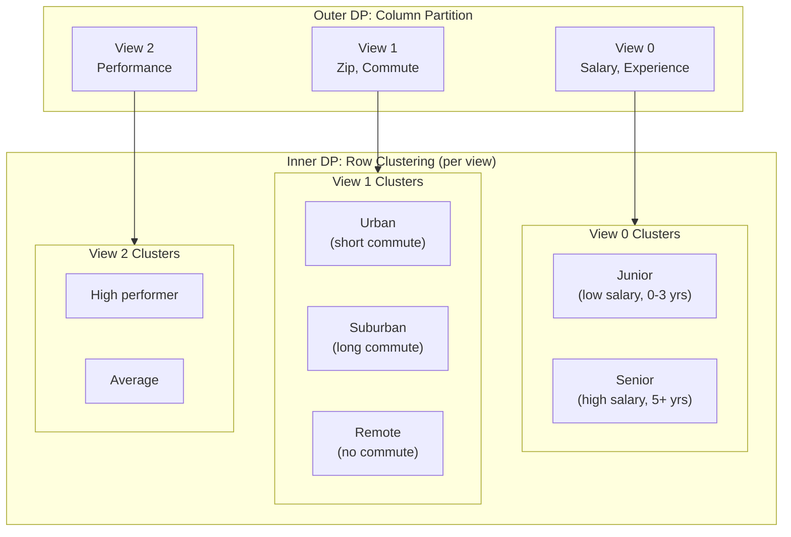
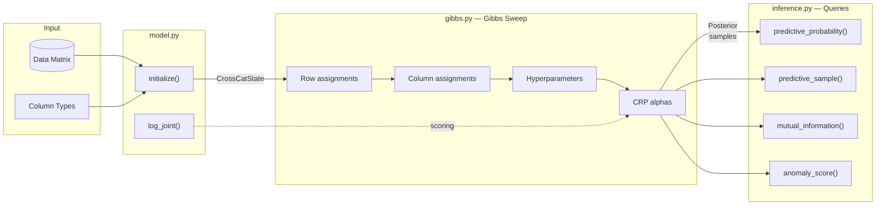
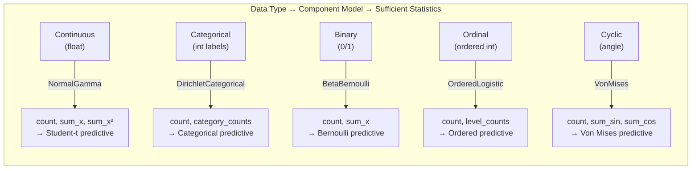

<p align="center">
  <strong>jax-crosscat</strong>
</p>

<p align="center">
  <em>GPU-accelerated Bayesian cross-categorization in JAX</em>
</p>

<p align="center">
  <a href="https://opensource.org/licenses/Apache-2.0"></a>
  <a href="https://www.python.org/downloads/"></a>
  <a href="https://github.com/sambhal-labs/jaxcross/actions"></a>
</p>

---

**jax-crosscat** is a modern reimplementation of [probcomp/crosscat](https://github.com/probcomp/crosscat) — the Bayesian nonparametric model that simultaneously discovers which columns are related and how rows cluster within each group. Built on [JAX](https://github.com/jax-ml/jax) for hardware-accelerated inference on CPU, GPU, and TPU.

## Why CrossCat?

Most clustering methods force a single partition over all columns. CrossCat discovers that *different subsets of columns may cluster rows differently*. A dataset of employees might cluster by `(salary, experience)` into seniority tiers, but independently cluster by `(commute_distance, zip_code)` into geographic regions — with no alignment between the two.

CrossCat models this with a **two-level Dirichlet Process**:



**Key insight**: Row 42 can be in `Senior` (view 0), `Remote` (view 1), and `High performer` (view 2) simultaneously. The clusterings are independent across views.

## Features

| Feature | Description |
|---------|-------------|
| **5 column types** | Continuous (Normal-Gamma), Categorical (Dirichlet-Categorical), Binary (Beta-Bernoulli), Ordinal (Ordered Logistic), Cyclic (Von Mises) |
| **Collapsed Gibbs** | All parameters integrated out via conjugacy — only cluster assignments are sampled |
| **Full query API** | Predictive probability, sampling, CDF, mutual information, anomaly detection, imputation, row similarity |
| **Missing data** | NaN values handled transparently — skipped during sufficient statistic computation |
| **Constraints** | Enforce column/row dependency constraints during inference |
| **Multi-chain** | Initialize multiple independent chains, select best by log-joint |
| **Packed state** | JIT-compatible padded representation for vectorized kernels |
| **Convergence diagnostics** | Adjusted Rand Index, log-joint tracking, held-out likelihood |

## Quick Start

```python
import jax
from crosscat import initialize, gibbs_sweep, predictive_sample, log_joint
from crosscat.types import ColumnType

# Your data: rows are observations, columns are features
# (here: 2 continuous + 2 categorical columns)
data = ...  # jnp.array of shape (n_rows, n_cols)
column_types = [
    ColumnType.CONTINUOUS,
    ColumnType.CONTINUOUS,
    ColumnType.CATEGORICAL,
    ColumnType.CATEGORICAL,
]

# Initialize and run inference
key = jax.random.key(42)
state = initialize(key, data, column_types)

key, subkey = jax.random.split(key)
state = gibbs_sweep(subkey, state, data, n_sweeps=100)

print(f"Log joint: {log_joint(state, data):.2f}")
print(f"Discovered {state.n_views} views")

# Query: sample column 0 given column 1 = 3.5
key, subkey = jax.random.split(key)
samples = predictive_sample(
    subkey, state, data,
    query_cols=[0],
    condition_cols=[1],
    condition_vals=jax.numpy.array([3.5]),
    n_samples=1000,
)
```

## Installation

We recommend [uv](https://docs.astral.sh/uv/) for fast, reproducible installs.

**CPU only:**
```bash
uv pip install jax-crosscat
```

**GPU support** (NVIDIA CUDA 13):
```bash
uv pip install "jax-crosscat[gpu]"
```

**GPU support** (AMD ROCm):
```bash
uv pip install jax[rocm] -f https://storage.googleapis.com/jax-releases/jax_rocm_releases.html
uv pip install jax-crosscat
```

**From source** (development):
```bash
git clone https://github.com/sambhal-labs/jaxcross.git
cd jaxcross
uv sync --extra dev
```

> **pip** also works: `pip install jax-crosscat` or `pip install "jax-crosscat[gpu]"`.

## Architecture



### Module Map

| Module | Purpose |
|--------|---------|
| [`types.py`](crosscat/types.py) | State dataclasses: `CrossCatState`, `ViewState`, `SufficientStats`, `ColumnHypers` |
| [`components.py`](crosscat/components.py) | Conjugate models: `NormalGamma`, `DirichletCategorical`, `BetaBernoulli`, `OrderedLogistic`, `VonMises` |
| [`model.py`](crosscat/model.py) | `initialize()`, `log_joint()`, `insert_rows()` |
| [`gibbs.py`](crosscat/gibbs.py) | MCMC kernels: row/column assignments, hyperparameters, CRP alphas, `gibbs_sweep()` |
| [`inference.py`](crosscat/inference.py) | Queries: `predictive_probability()`, `predictive_sample()`, `mutual_information()`, `anomaly_score()`, `impute_and_confidence()`, `row_similarity()` |
| [`packed/`](crosscat/packed/) | JIT-compatible padded state with vectorized kernels (`state.py`, `components.py`, `suffstats.py`, `kernels.py`) |
| [`packed_inference.py`](crosscat/packed_inference.py) | Vectorized inference queries on packed state |
| [`constraints.py`](crosscat/constraints.py) | Column/row dependency constraint enforcement |
| [`diagnostics.py`](crosscat/diagnostics.py) | ARI, convergence metrics, held-out likelihood, imputation evaluation |
| [`serialization.py`](crosscat/serialization.py) | Save/load states and checkpoints (`.jxc` format) |
| [`synthetic.py`](crosscat/synthetic.py) | Synthetic data generation for testing |
| [`data_utils.py`](crosscat/data_utils.py) | CSV I/O, column type detection, discretization |
| [`validate.py`](crosscat/validate.py) | State consistency checking |

### Component Models

Each column type uses a conjugate Bayesian model — parameters are analytically integrated out, so only cluster assignments need to be sampled:



## API Reference

### Initialization & Scoring

```python
# Initialize state (single or multi-chain)
state = initialize(key, data, column_types, n_chains=1,
                   initialization="from_the_prior")  # or "together", "apart"

# Score the model
score = log_joint(state, data)

# Insert new rows (no re-inference on existing)
state, data = insert_rows(key, state, data, new_rows)
```

### Inference

```python
# Full Gibbs sweep (configurable kernels)
state = gibbs_sweep(key, state, data, n_sweeps=100,
                    kernels=("row_assignments", "column_assignments",
                             "column_hypers", "crp_alphas"))
```

### Queries

```python
from crosscat.inference import (
    predictive_probability, predictive_sample, mutual_information,
    predictive_anomalousness, row_similarity, impute_and_confidence,
    predictive_cdf,
)

# Conditional probability: p(col=val | conditions)
log_p = predictive_probability(state, data, query_cols=[0],
                               query_vals=jnp.array([3.5]),
                               condition_cols=[1],
                               condition_vals=jnp.array([2.0]))

# Posterior predictive samples
samples = predictive_sample(key, state, data, query_cols=[0, 1],
                            n_samples=1000)

# Mutual information between columns (averaged over posterior)
mi, linfoot = mutual_information(states, col_i=0, col_j=1)

# Anomaly detection
anomaly = predictive_anomalousness(key, state, data, query_row=42)

# Row similarity (probability of same cluster)
sim = row_similarity(states, row_a=10, row_b=20)

# Imputation with confidence
value, confidence = impute_and_confidence(key, state, data, query_col=3)

# Predictive CDF
cdf_val = predictive_cdf(key, state, data, query_col=0,
                         query_val=jnp.array(5.0))
```

### Constraints

```python
from crosscat.constraints import ensure_col_dep_constraints

# Force columns 0 and 1 into the same view
state = ensure_col_dep_constraints(
    key, state, data,
    constraints=[(0, 1, True)],  # (col_a, col_b, dependent)
)
```

### Serialization

```python
from crosscat import save_packed_state, load_packed_state, save_checkpoint, load_latest_checkpoint

# Save packed state
save_packed_state(packed, "my_model", column_types=column_types)

# Load it back
packed, col_types = load_packed_state("my_model")

# Checkpoint during inference
save_checkpoint(packed, "checkpoints/", sweep_number=50,
                column_types=column_types, log_joint_value=score)

# Resume from latest checkpoint
packed, col_types, sweep_num = load_latest_checkpoint("checkpoints/")
```

### Diagnostics

```python
from crosscat.diagnostics import column_partition_ari, collect_diagnostics

# Compare inferred partition to ground truth
ari = column_partition_ari(state, true_assignments)

# Collect per-sweep metrics
metrics = collect_diagnostics(state, data)
# {'log_joint': -1234.5, 'n_views': 3, 'n_clusters_per_view': [2, 3, 2], ...}
```

## Performance

The `crosscat.packed` sub-package provides a JIT-compatible representation using padded fixed-size arrays. All Python-level branching on column types is replaced with `jnp.where` dispatch, enabling full XLA compilation via `jax.lax.scan` and `jax.vmap`:

```python
from crosscat.packed import pack_state, packed_gibbs_sweep, unpack_state

# Convert to packed representation
packed = pack_state(state, max_views=16, max_clusters=32)

# Run JIT-compiled inference (all 4 kernels per sweep)
packed = packed_gibbs_sweep(key, packed, data, n_sweeps=100)

# Convert back (pass data= for exact suffstats fidelity)
state = unpack_state(packed, column_types, data=data)
```

Individual kernels are also available for fine-grained control:

```python
from crosscat.packed import (
    packed_transition_row_assignments,
    packed_transition_column_assignments,
    packed_transition_column_hypers,
    packed_transition_crp_alphas,
)
```

Run the benchmark to compare:
```bash
python benchmarks/jit_benchmark.py
```

## Testing

```bash
# Fast tests (~10 min, includes packed state + unit tests)
uv run pytest -m "not slow"

# Full suite including recovery tests (~30 min)
uv run pytest

# Single test file
uv run pytest tests/test_packed_state.py -v
```

**Test coverage**: 127 fast tests + 31 slow integration tests (158 total) covering all 5 column types, missing data, convergence diagnostics, anomaly detection, mutual information, constraints, row similarity, serialization, multi-chain inference, and packed kernel correctness.

## Development

```bash
# Install dev dependencies
uv sync --extra dev

# Lint
uv run ruff check .

# Format
uv run ruff format .

# Type check
uv run mypy crosscat/ --ignore-missing-imports
```

### Pre-commit hooks

```bash
uv tool install pre-commit
pre-commit install
```

## Roadmap

- [x] Full feature parity with probcomp/crosscat
- [x] Five conjugate component models
- [x] Packed state with vectorized kernels
- [x] Integration test suite (30+ tests)
- [x] Full JIT compilation of Gibbs sweep via `jax.lax.scan`
- [x] `jax.vmap` over rows/columns in all packed kernels
- [x] Column assignment kernel (outer DP Gibbs)
- [x] GPU benchmark suite (`notebooks/gpu_benchmark.ipynb`)
- [x] Interactive visualization dashboard (`dashboard/`)
- [x] State serialization (save/load/checkpoint)
- [x] Parallel multi-chain inference via `jax.vmap`
- [x] GPU-validated test suite (127 fast + 31 slow tests)
- [ ] PyPI release

## References

- Mansinghka, V., Shafto, P., Jonas, E., Petschulat, C., Gasner, M., & Tenenbaum, J. B. (2016). *CrossCat: A Fully Bayesian Nonparametric Method for Analyzing Heterogeneous, High Dimensional Data.* JMLR, 17(138), 1-49.
- Dinari, O. & Zamir, T. (2022). *GPU-accelerated Dirichlet Process Mixture Models.*
- Original implementation: [probcomp/crosscat](https://github.com/probcomp/crosscat)

## License

[Apache 2.0](LICENSE)
