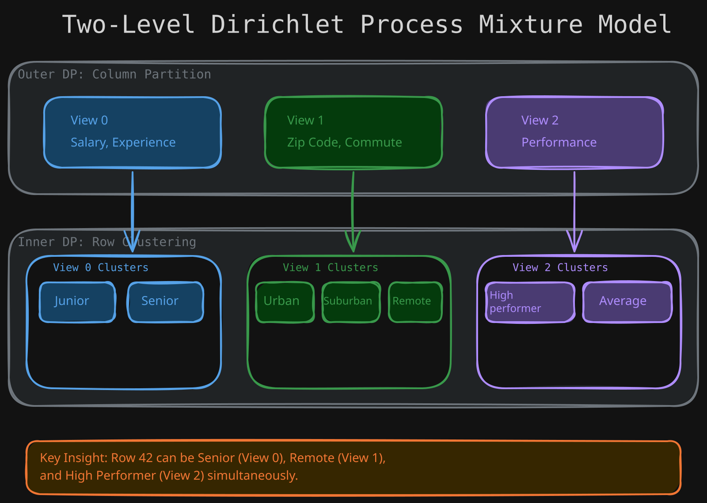
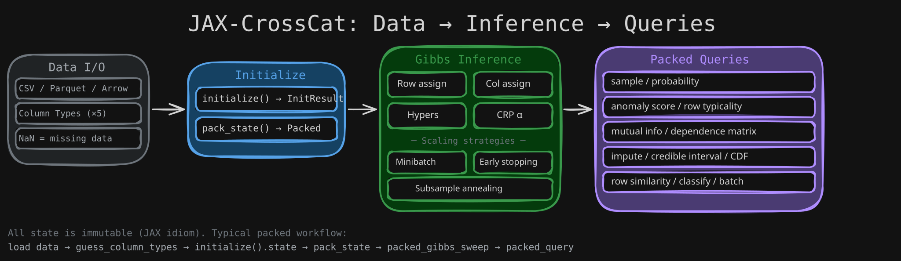

<p align="center">
  
</p>

<h1 align="center">jax-crosscat</h1>

<p align="center">
  <em>Discover hidden structure in tabular data — automatically.<br/>No feature engineering. No model selection. Just jaxcross.</em>
</p>

<p align="center">
  <a href="https://github.com/sambhal-labs/jaxcross/releases"></a>
  <a href="https://mariadb.com/bsl11/"></a>
  <a href="https://www.python.org/downloads/"></a>
  <a href="https://github.com/sambhal-labs/jaxcross/actions"></a>
  <a href="https://sambhal-labs.github.io/jaxcross/"></a>
  
  
  <a href="https://github.com/sambhal-labs/jaxcross/pulls"></a>
  <a href="https://github.com/sambhal-labs/jaxcross/stargazers"></a>
</p>

<p align="center">
  <a href="#quick-start">Quick Start</a> &middot;
  <a href="https://sambhal-labs.github.io/jaxcross/">Documentation</a> &middot;
  <a href="#use-cases">Use Cases</a> &middot;
  <a href="benchmarks/">Benchmarks</a> &middot;
  <a href="https://github.com/sambhal-labs/jaxcross/discussions">Community</a>
</p>

<p align="center">
  <a href="https://colab.research.google.com/github/sambhal-labs/jaxcross/blob/main/notebooks/intro_tutorial.ipynb"></a>
</p>

---

<p align="center">
  <strong>12x faster</strong> than sequential inference &nbsp;&middot;&nbsp;
  <strong>5 native</strong> column types &nbsp;&middot;&nbsp;
  <strong>93% accuracy</strong> on MNIST inpainting &nbsp;&middot;&nbsp;
  <strong>Fully Bayesian</strong> — zero hyperparameter tuning
</p>

---

**jax-crosscat** automatically discovers hidden structure in your data — which columns are related, how rows cluster, and how to predict missing values — all without manual feature engineering or model selection.

Built on [JAX](https://github.com/jax-ml/jax) for hardware-accelerated inference on GPU and TPU. A modern reimplementation of [probcomp/crosscat](https://github.com/probcomp/crosscat) (Mansinghka et al., JMLR 2016).

## The Problem

Most clustering methods force a single partition over all columns. Real data doesn't work that way.

An employee dataset might cluster by `(salary, experience)` into seniority tiers, but independently by `(commute_distance, zip_code)` into geographic regions — with no alignment between the two. CrossCat discovers these **multiple overlapping structures** automatically.

## Use Cases

- **Customer Segmentation** — Discover natural segments in mixed-type customer data (demographics, behavior, spend) without choosing k or encoding categories
- **Anomaly & Fraud Detection** — Score how unusual each row is relative to the learned structure; flag outliers across heterogeneous record types
- **Missing Data Imputation** — Fill in missing values with Bayesian confidence scores; no separate imputation pipeline needed
- **Scientific Data Exploration** — Uncover which variables are related in genomics, economics, or sensor data without assuming a model
- **Feature Relationship Discovery** — Build a dependence matrix showing which features carry information about each other, informing ML pipelines

## Key Capabilities

<table>
<tr>
<td width="50%">

**Automatic Structure Discovery**
- Discovers which columns are statistically related
- Finds independent clustering structures per column group
- Infers the number of clusters automatically — no k to tune

</td>
<td width="50%">

**Rich Query API**
- Predictive probability, sampling, and CDF
- Anomaly detection and row similarity
- Mutual information and dependence discovery
- Missing value imputation with confidence scores

</td>
</tr>
<tr>
<td>

**Production-Ready**
- 5 column types: continuous, categorical, binary, ordinal, cyclic
- Transparent NaN handling — no preprocessing needed
- Serialization, checkpointing, and convergence diagnostics
- Constraint enforcement for domain knowledge

</td>
<td>

**GPU-Accelerated**
- JIT-compiled packed state with vectorized Gibbs kernels
- 12x speedup over sequential scoring via `vmap`
- Multi-chain inference with automatic best-chain selection
- XLA persistent compilation cache for instant restarts

</td>
</tr>
</table>

## Quick Start

```bash
git clone https://github.com/sambhal-labs/jaxcross.git && cd jaxcross
uv sync --extra dev                    # CPU
uv sync --extra dev --extra gpu        # GPU (NVIDIA CUDA)
```

```python
import jax
import jax.numpy as jnp
from crosscat import initialize, dependence_matrix
from crosscat.packed import pack_state, packed_gibbs_sweep, unpack_state
from crosscat.types import ColumnType

# Load and configure
data = jnp.array(your_data, dtype=jnp.float32)
col_types = [ColumnType.CONTINUOUS, ColumnType.CATEGORICAL, ...]

# Initialize → Pack → Infer → Unpack → Query
key = jax.random.key(42)
result = initialize(key, data, col_types)
state = result.state                    # InitResult wraps the state
packed = pack_state(state)
packed = packed_gibbs_sweep(jax.random.key(1), packed, data, n_sweeps=100)
state = unpack_state(packed, col_types, data=data)

# Discover column relationships
z_matrix = dependence_matrix([state])   # which columns are related?

# Impute missing values with confidence
from crosscat import impute_and_confidence
value, confidence = impute_and_confidence(jax.random.key(2), state, data, query_col=3, row_id=0)
```

> **Want the full walkthrough?** Open the **[Interactive Tutorial](notebooks/intro_tutorial.ipynb)** in Colab — covers synthetic data, inference, and 7 query types end-to-end.
>
> [](https://colab.research.google.com/github/sambhal-labs/jaxcross/blob/main/notebooks/intro_tutorial.ipynb)

## Column Types

CrossCat natively handles mixed-type data — no encoding or preprocessing required:

| Type | Statistical Model | Example Data |
|------|-------------------|-------------|
| `CONTINUOUS` | Normal-Gamma (conjugate) | Salary, temperature, sensor readings |
| `CATEGORICAL` | Dirichlet-Categorical | Department, country code, product category |
| `BINARY` | Beta-Bernoulli | Yes/no flags, presence/absence |
| `ORDINAL` | Ordered Logistic (cumulative link) | Star ratings, education level, severity |
| `CYCLIC` | Von Mises | Wind direction, time of day, compass bearing |

## Query API

After inference, ask questions about your data:

```python
from crosscat import (
    predictive_probability,     # P(col=value | context)
    predictive_sample,          # Draw from posterior predictive
    predictive_cdf,             # P(X <= value | context)
    impute_and_confidence,      # Fill missing values with confidence
    mutual_information,         # Information shared between columns
    dependence_matrix,          # Full pairwise column dependency matrix
    predictive_anomalousness,   # Detect unusual rows
    row_similarity,             # How similar are two rows?
    row_typicality,             # Structural anomaly score
    column_typicality,          # Column-level anomaly
    credible_interval,          # Bayesian credible intervals
    conditional_entropy,        # Remaining uncertainty in a column
    joint_predictive_probability, # Joint P(multiple cols | context)
    sample_and_insert,          # Impute missing + insert row
)
```

All 15 unpacked queries have packed equivalents with GPU acceleration, plus 8 batch functions and 5 multi-chain wrappers (29 total in packed_inference.py) for production use. All queries are fully Bayesian — they integrate over cluster assignment uncertainty, not just point estimates. See the [Query Guides](https://sambhal-labs.github.io/jaxcross/guides/queries/sampling/) for detailed examples.

## Performance

| Dataset | Rows x Cols | Per Sweep | 100 Sweeps |
|---------|-------------|-----------|------------|
| Small (mixed types) | 50 x 11 | 4.5s | 7.5 min |
| Medium (binary+cat) | 100 x 65 | 4.8s | 8 min |
| MNIST 16x16 | 1,000 x 257 | 12s | 20 min |

Benchmarked on NVIDIA P100 GPU. See [benchmarks/](benchmarks/) for reproduction scripts including the [MNIST paper benchmark](benchmarks/mnist_paper_colab.ipynb).

## Features

| Category | Details |
|----------|---------|
| **Column Types** | Continuous (Normal-Gamma), Categorical (Dirichlet-Categorical), Binary (Beta-Bernoulli), Ordinal (Ordered Logistic), Cyclic (Von Mises) |
| **Inference** | Collapsed Gibbs sampling, multi-chain with best-chain selection, constraint enforcement, convergence diagnostics |
| **GPU Acceleration** | JIT-compiled packed state, vectorized kernels via `vmap`/`lax.scan`, XLA persistent compilation cache, 12x speedup |
| **Query API** | 15 unpacked + 16 packed + 8 batch + 5 multi-chain query functions: predictive probability, sampling, CDF, anomaly detection, mutual information, dependence discovery, imputation with confidence, row similarity, credible intervals, conditional entropy, classification |
| **Batched Operations** | Vectorized column scoring, batched suffstat updates, batch posterior predictive for all 5 types, multi-chain wrappers |
| **Streaming / Online** | `packed_insert_rows` for incremental row insertion without full re-inference, `sample_and_insert` for posterior-aware insertion |
| **Data Handling** | Transparent NaN (missing data), CSV/Parquet/Arrow/NPY/NPZ I/O, auto type detection, discretization, chunked reading, memory-mapped loading |
| **Production** | Serialization (`.jxc` format), checkpointing, state validation, TensorBoard logging, deterministic RNG for reproducibility |
| **Scaling** | Subsample initialization, mini-batch Gibbs, parallel row scoring, early stopping, subsample annealing for 10K+ row datasets |
| **Constraints** | Column dependency enforcement (must-link / cannot-link), row clustering constraints via rejection sampling |

## Architecture

<p align="center">
  
</p>

CrossCat uses a **two-level Dirichlet Process** mixture model:
1. **Outer DP** partitions columns into views (column groups)
2. **Inner DP** per view clusters rows independently

All component parameters are collapsed out via conjugate priors — only cluster assignments and hyperparameters are sampled via Gibbs.

The **packed path** converts variable-size Python state into fixed-size JAX arrays for JIT compilation with `lax.scan` and `vmap`, enabling GPU-accelerated inference.

```
CrossCatState  ──pack_state()──▸  PackedCrossCatState  ──packed_gibbs_sweep()──▸  ...  ──unpack_state()──▸  CrossCatState
  (Python)                          (JAX arrays, JIT)                                                        (query-friendly)
```

See [Architecture Docs](https://sambhal-labs.github.io/jaxcross/architecture/overview/) for deep dives into the model, kernels, and JAX patterns.

## Project Structure

```
crosscat/                            # Core library
├── types.py                         #   Dataclasses: CrossCatState, ViewState, ColumnType
├── components.py                    #   5 Bayesian component models (conjugate + grid)
├── model.py                         #   Initialization, scoring, row insertion
├── gibbs.py                         #   Collapsed Gibbs MCMC kernels (unpacked)
├── inference.py                     #   15 posterior predictive queries (unpacked path)
├── packed/                          #   JIT-compiled packed state sub-package
│   ├── state.py                     #     Pack/unpack, batching, multi-chain
│   ├── components.py                #     Unified type-dispatched scoring
│   ├── kernels.py                   #     Vectorized Gibbs kernels (vmap + lax.scan)
│   ├── suffstats.py                 #     Batched sufficient statistics
│   └── aot_cache.py                 #     XLA persistent compilation cache
├── packed_inference.py              #   16 packed + 8 batch + 5 multi-chain query functions
├── constraints.py                   #   Column/row dependency enforcement
├── diagnostics.py                   #   ARI, log-joint, held-out likelihood
├── serialization.py                 #   Save/load in .jxc format
├── synthetic.py                     #   Synthetic data generation
├── data_utils.py                    #   CSV I/O, type detection
├── scaling.py                       #   Large dataset workflows (subsample, minibatch, early stopping)
├── tb_logger.py                     #   TensorBoard logging for inference monitoring
└── validate.py                      #   State consistency checking

tests/                               # 339 fast tests + 70 slow tests (409 total)
notebooks/                           # Interactive tutorials and test runners
benchmarks/                          # MNIST, WDI, synthetic, JIT benchmarks
dashboard/                           # Streamlit interactive analysis UI
docs/                                # MkDocs documentation site
examples/                            # Example scripts (streaming inference)
contrib/                             # Community contributions (fingerprinting)
paper/                               # Research paper materials
```

## Documentation

| Resource | Description |
|----------|-------------|
| **[Interactive Tutorial](notebooks/intro_tutorial.ipynb)** | Hands-on notebook: data generation, inference, 7 query types |
| **[Getting Started](https://sambhal-labs.github.io/jaxcross/getting-started/installation/)** | Installation, quickstart, core concepts |
| **[Feature Guides](https://sambhal-labs.github.io/jaxcross/guides/)** | Deep dives into every capability |
| **[Query Guides](https://sambhal-labs.github.io/jaxcross/guides/queries/sampling/)** | Dedicated guides for each query type |
| **[API Reference](https://sambhal-labs.github.io/jaxcross/api/types/)** | Complete function documentation (116 exported symbols) |
| **[Architecture](https://sambhal-labs.github.io/jaxcross/architecture/overview/)** | Internal design, JAX patterns, performance |
| **[Benchmarks](benchmarks/)** | MNIST, synthetic recovery, JIT timing |
| **[Full Docs Site](https://sambhal-labs.github.io/jaxcross/)** | Searchable hosted documentation |

## Examples

| Example | Colab | Description |
|---------|-------|-------------|
| **[MNIST Benchmark](benchmarks/mnist_paper_colab.ipynb)** | [](https://colab.research.google.com/github/sambhal-labs/jaxcross/blob/main/benchmarks/mnist_paper_colab.ipynb) | Reproduce Section 3.2 of the JMLR paper — pixel dependence, inpainting, classification |
| **[WDI Macroeconomics](benchmarks/wdi_macroeconomic_benchmark.ipynb)** | [](https://colab.research.google.com/github/sambhal-labs/jaxcross/blob/main/benchmarks/wdi_macroeconomic_benchmark.ipynb) | Real-world GDP, trade, and population data — structure discovery in economics (gold-standard workflow reference) |
| **[Intro Tutorial](notebooks/intro_tutorial.ipynb)** | [](https://colab.research.google.com/github/sambhal-labs/jaxcross/blob/main/notebooks/intro_tutorial.ipynb) | End-to-end walkthrough: synthetic data, inference, 7 query types |

## Development

```bash
uv run pytest                          # Run tests (recommend GPU/Colab)
uv run pytest -m "not slow"            # Fast tests only
uv run ruff check . && uv run ruff format .  # Lint & format
```

## Community

- **[GitHub Discussions](https://github.com/sambhal-labs/jaxcross/discussions)** — Questions, ideas, show & tell
- **[Issue Tracker](https://github.com/sambhal-labs/jaxcross/issues)** — Bug reports and feature requests
- **[Contributing Guide](docs/contributing.md)** — How to contribute
- **[Code of Conduct](CODE_OF_CONDUCT.md)** — Our community standards
- **[Security Policy](SECURITY.md)** — How to report vulnerabilities

## Citation

If you use jax-crosscat in your research, please cite the original CrossCat paper:

```bibtex
@article{mansinghka2016crosscat,
  title={CrossCat: A Fully Bayesian Nonparametric Method for Analyzing
         Heterogeneous, High Dimensional Data},
  author={Mansinghka, Vikash and Shafto, Patrick and Jonas, Eric and
          Petschulat, Cap and Gasner, Max and Tenenbaum, Joshua B},
  journal={Journal of Machine Learning Research},
  volume={17},
  number={138},
  pages={1--49},
  year={2016}
}
```

## License

[Business Source License 1.1](LICENSE) — free for non-production use (research, education, evaluation, benchmarking). Production use requires a [commercial license](mailto:contact@sambhal-labs.com). Converts to Apache 2.0 on 2030-04-01.
