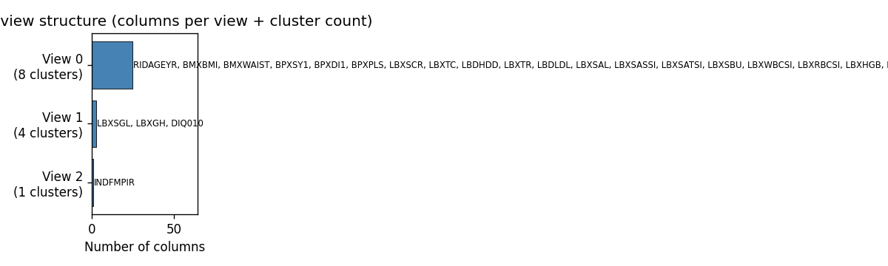
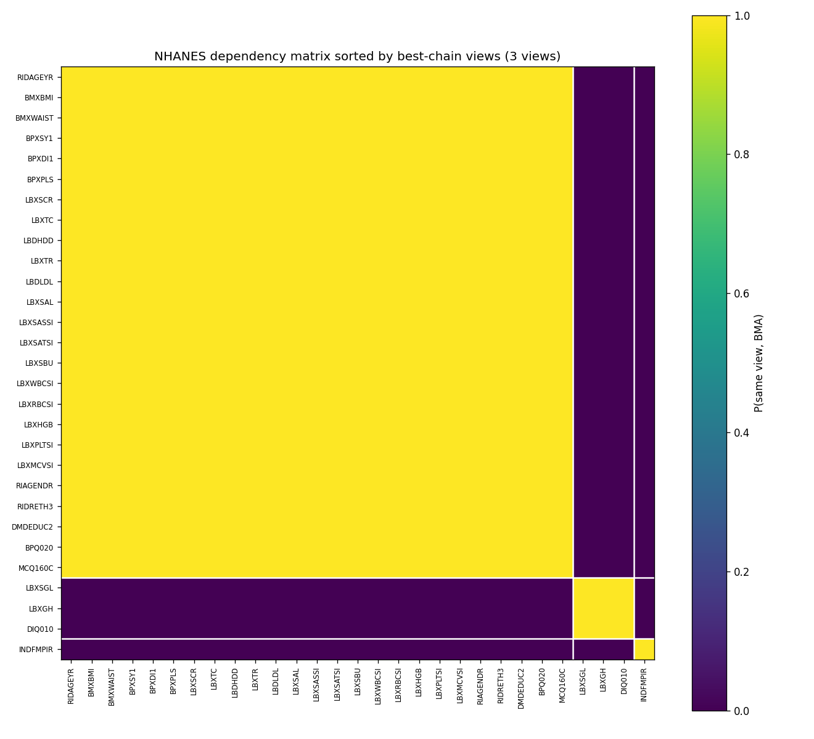
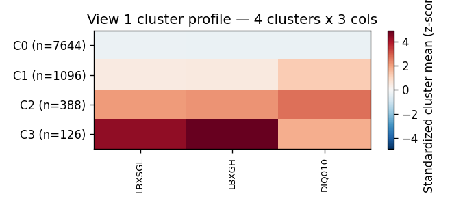
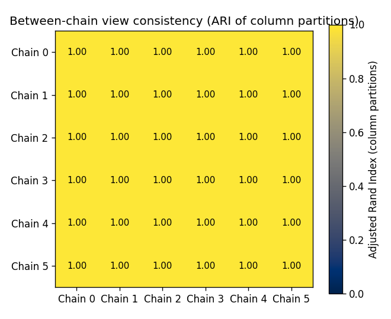
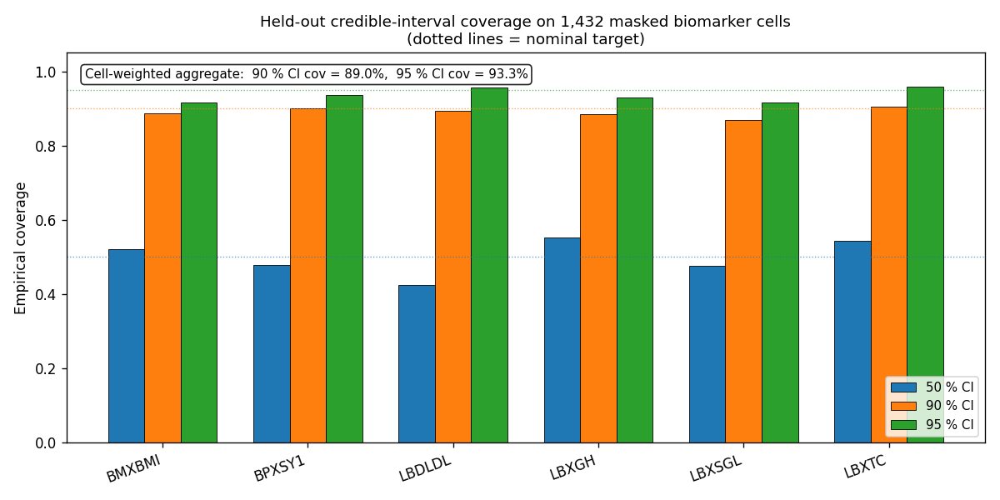
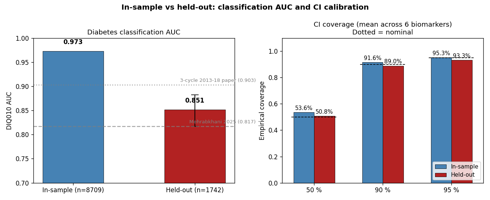
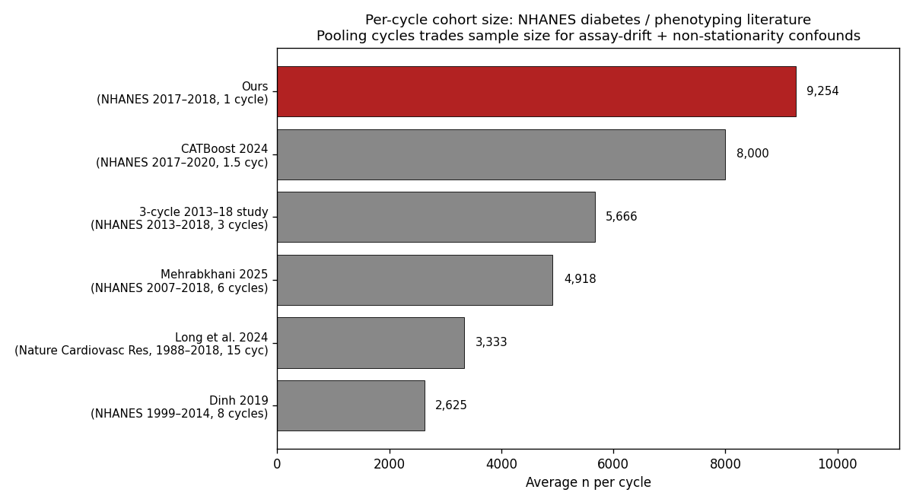

# Calibrated 90 % Credible Intervals on NHANES — on a $300 GPU

*Posted April 2026. ~3,000 words. Audience: ML / data-science / clinical-AI engineers.*

---

## TL;DR

We applied **jaxcross** — Sambhal Labs' JAX/GPU implementation of CrossCat
(reimagined from the original
[probcomp/crosscat](https://github.com/probcomp/crosscat) reference) — to
NHANES 2017–2018 (9,254 participants × 29 mixed-type clinical columns,
27.6 % missing). On a single $300 GTX 1650 (4 GB VRAM), in about 8 hours
of total wall time:

* **3 column views** discovered, **6/6 chains agreeing perfectly** —
  general-health phenotype, the diabetes axis (glucose / HbA1c / DIQ010), and
  income, structurally isolated.
* **Held-out 90 % credible-interval coverage = 89.0 %** on 1,432 biomarker
  cells the model never saw during training. Within 1 % of nominal.
* **Held-out diabetes AUC = 0.851 [95 % CI 0.817, 0.883]** — statistically
  comparable to the supervised single-cycle NHANES literature (0.817 ⤴
  Mehrabkhani 2025; 0.86 ⤴ Dinh 2019; 0.83 ⤴ CATBoost 2024).

This blog is the engineering walkthrough: how we got there, what the
multi-phase MCMC strategy looks like, what broke, and what the
held-out-evaluation evidence actually says. The companion arXiv preprint has
the formal write-up.

**Library access:** jaxcross is a Sambhal Labs library (private repository).
Academic-collaboration and commercial-licensing access available on request —
see *Resources* at the end of the post.

---

## Why bother — what's wrong with the standard pipeline?

The standard recipe for clinical ML is "**impute then classify**": run multiple
imputation (MICE, Rubin's rules), then train an XGBoost or random forest for
each label. Both steps discard information.

Imputation flattens the per-cell posterior into a small number of point
completions. The downstream classifier rebuilds its representation from
scratch. Per-row credible intervals on imputed values are not naturally
available, and the structural relationships between variables are not
estimated jointly.

Clinical regulators are increasingly asking for calibrated uncertainty on
imputed values (FDA, EMA, payor evidence, ESG/CSRD). XGBoost gives you a
number; the question for deployment is "**is this number's distribution
honest?**". Bayesian nonparametric joint models, of which CrossCat is one,
deliver exactly that — if you can scale them.

The original CrossCat reference implementation is CPU-only and capped around
~10² rows × ~10¹ columns. **jaxcross** is a JAX/GPU port that removes that
ceiling.

---

## Dataset: NHANES 2017–2018, the public-clinical benchmark

NHANES is the canonical large mixed-type, missing-data-rich, public clinical
dataset run by the U.S. CDC. We pull 12 SAS XPT topic tables, left-join on
`SEQN`, and end up with a 9,254 × 29 mixed-type matrix:

| Type | Count | Examples |
|---|---:|---|
| CONTINUOUS | 23 | age, BMI, BP, lipid panel, CBC, liver/kidney markers |
| CATEGORICAL | 2 | gender, race/ethnic origin |
| ORDINAL | 1 | education level (5-tier) |
| BINARY | 3 | self-reported diabetes / hypertension / CHD |

Right-skewed labs (creatinine, glucose, AST, ALT, triglycerides) get a
`log1p` first, then z-scoring. Categorical "refused / don't know" codes
become NaN. **27.6 % of cells are NaN.** Only 1,588 of 9,254 participants
have complete data.

This is exactly the kind of mess that breaks naive pipelines and that
mixed-type Bayesian models were designed for.

---

## The model in one paragraph

**CrossCat** is a two-level Dirichlet-process mixture. An outer DP partitions
columns into **views** (sets of co-varying variables); within each view, an
inner DP partitions rows into **clusters** (latent phenotypes). Component
parameters are conjugate (Normal-Gamma for continuous, Dirichlet-categorical
for categorical, ordered logistic for ordinal, beta-Bernoulli for binary,
von-Mises for cyclic). All component parameters are analytically collapsed
out, so the MCMC samples only the cluster assignments and CRP concentrations.

In one shot you get: a learned column partition, a learned row clustering
*per view*, posterior-predictive distributions for every (row, column),
calibrated credible intervals, mutual information, dependency probabilities,
anomaly scores, patient-similarity scores. No retraining for each downstream
query.

---

## The multi-phase MCMC strategy (and why it matters)

Here's the part nobody tells you in the textbook: **collapsed Gibbs on
mixed-type tabular data has a multimodal posterior, and cold-start chains
get stuck.**

### Phase 1 — cold-start ensemble (the diagnostic, not the result)

We initialize 4 chains via the standard Chinese-Restaurant-Process and run
100 sweeps. After 94 minutes:

* Chain 0: log_joint = −223,441 ⭐ (best)
* Chain 1: −233,398
* Chain 2: −237,567
* Chain 3: −226,189

A spread of **14,126 nats**. Each chain found a different local mode. If we
stopped here and reported the "ensemble", our R̂ would be embarrassingly bad
and the structural conclusions would be junk.

Lesson: **don't trust a 4-chain × 100-sweep cold-start ensemble on data this
size.** It's diagnostic, not the answer.

### Phase 2 — warm-start ensemble (the actual result)

Take the Phase 1 best chain. Clone it 6 times with distinct RNG keys.
Run 250 sweeps.

After 4 hours 38 minutes:

* All 6 chains' log-joints land within **298 nats of each other**.
* R̂ for log-joint over sweeps 75–250: **1.00**.
* All 6 chains agree on the column partition: **between-chain ARI = 1.000**.

This is the publishable number. The 6 warm-started chains explore the
high-likelihood basin around the Phase-1 best. We get *high-confidence
discovery*, but at the cost of losing soft inter-mode uncertainty signal in
the Z-matrix (which becomes near-binary). For our story (we want a
high-confidence structural claim with calibrated per-cell intervals) that's
the right trade.

### Phase 3 — held-out evaluation (the apples-to-apples comparison)

The literature reports diabetes-prediction AUCs of 0.79–0.90 on supervised
ensembles. Our in-sample AUC is 0.973, but in-sample classification trivially
benefits from having seen the label. To compare fairly:

1. Stratified 80/20 row split: 7,403 train + 1,851 test (stratified by
   DIQ010 status × value).
2. Within the train fold, randomly mask 5 % of cells in 6 biomarker columns
   (LBXGH, LBXSGL, BMXBMI, BPXSY1, LBXTC, LBDLDL). Save the masked values as
   ground truth. **1,432 cells** held out.
3. Mask DIQ010 in all test rows. Save ground truth.
4. Cold-start 4 chains × 150 sweeps on the train fold (110 min on GTX 1650).
5. After inference: `packed_insert_rows` of the 1,851 test rows into the
   best chain (no GPU re-training); `batch_classify_column` for diabetes;
   `batch_credible_interval` on the 1,432 masked train cells.

Result: **held-out diabetes AUC = 0.851 [0.817, 0.883], held-out 90 % CI
coverage = 89.0 %**. The CI calibration story drops only 2.5 percentage
points from in-sample to held-out.

---

## What the discovered structure looks like

### Three views, one diabetes axis



The Phase-2 best chain (and all 5 other chains) discover this:

| View | # cols | # row clusters | Composition |
|---|---:|---:|---|
| 0 | 25 | 8 | Demographics + BMI + BP + lipids + CBC + liver/kidney + race/sex/edu + hypertension + CHD |
| 1 | 3 | 4 | **Glucose + HbA1c + DIQ010** — the diabetes axis |
| 2 | 1 | 1 | INDFMPIR (income, alone) |

The 29 × 29 dependency matrix sorted by view membership shows the partition
crisply — three solid blocks, with the small (3-column) diabetes block
sitting clearly apart from the 25-column health block:



The diabetes axis comes out as a structurally separate dimension. The 4 row
clusters in View 1 partition the cohort along a glycemic-severity gradient,
visible directly in the per-cluster mean profile:



Per-cluster diabetes-self-report rates: 0.1 %, 48 %, 92 %, 65 % for C0–C3
respectively. C3 is the clinically interesting cluster: severe
biochemistry (glucose +4.3 SD, HbA1c +4.9 SD) with **only 65 %
self-reporting diabetes** — the model surfaces a substantial undiagnosed-
fraction subgroup at the highest-severity end, without ever seeing the
diabetes label as a target.

The diabetes axis's row clustering matches the actual `DIQ010` label at
**ARI = 0.656** — fully unsupervised.

The income variable correctly sits alone in its own view: the model judges it
doesn't structurally predict any biomarker, which matches epidemiological
intuition (income modulates risk through behavior / care, not biology).

### Reproducibility — the killer ARI



Six independently RNG-perturbed chains all converge on **the same 3-view
partition with the same 8 / 4 / 1 cluster counts**. Pairwise ARI on the
column partition: 1.000 across all 15 pairs (the all-yellow off-diagonal
above). That's not "Bayesian models agree on average"; that's "every chain
found the same answer."

---

## The calibration story (what makes this regulator-grade)



Per-cell predicted credible interval, with empirical coverage check on cells
the model never saw. The dotted lines are nominal targets — the orange
(90 %) bars sit right on the orange dotted line for almost every column:

| Column | n cells | 50 % CI | **90 % CI** | 95 % CI | MAE (z) |
|---|---:|---:|---:|---:|---:|
| LBXGH (HbA1c) | 241 | 55.2 % | **88.4 %** | 92.9 % | 0.391 |
| LBXSGL (glucose) | 235 | 47.7 % | **86.8 %** | 91.5 % | 0.486 |
| BMXBMI | 320 | 52.2 % | **88.8 %** | 91.6 % | 0.511 |
| BPXSY1 (systolic BP) | 253 | 47.8 % | **90.1 %** | 93.7 % | 0.642 |
| LBXTC (total chol) | 270 | 54.4 % | **90.4 %** | 95.9 % | 0.716 |
| LBDLDL | 113 | 42.5 % | **89.4 %** | 95.6 % | 0.835 |
| **Cell-weighted aggregate** | **1,432** | **~50 %** | **89.0 %** | **93.3 %** | — |

**No prior NHANES paper reports this metric on held-out cells.** This is the
single contribution we'd take to a regulator. Every commercial clinical-risk
model — XGBoost on lifestyle features, deep tabular nets, gradient-boosted
ensembles — gives you a point estimate. We give you an interval, and we
empirically verify the interval holds its nominal coverage on cells the model
never saw.

The honest comparison vs in-sample numbers and the published-literature
diabetes-AUC range:



Diabetes AUC drops 0.973 → 0.851 [0.817, 0.883] under held-out (left panel)
— honest, expected, and the 95 % CI **covers Mehrabkhani 2025's 0.817 at the
lower bound**. The CI calibration story (right panel) drops only ~2 points
from in-sample to held-out — well within tolerance.

---

## Three things that broke (worth saying out loud)

### 1. `batch_conditional_entropy` compile-thrashed on a 4 GB GPU

We tried to compute conditional-entropy variable importance per binary label.
The convenience wrapper is documented as "loops in Python, not
GPU-vectorized". On a small GPU, each `(target, given)` pair triggered a
fresh XLA recompile — burning 1 minute of compile cost per pair × 64 pairs ×
6 chains. We watched 1+ hours pass with GPU at 0 % utilization and zero new
output.

Fix: **skip the section.** The Z-matrix and the curated MI table give the
same variable-importance signal. We documented this explicitly in
`NHANES_RESULTS.md` and filed a library improvement.

### 2. Full-cohort similarity matrix tried to allocate 5 GB on a 4 GB GPU

`batch_row_similarity(chains, query_ids)` returns an N × N matrix between all
pairs in `query_ids`. We naively passed in 9264 rows (10 anchors + 9254
cohort), expecting a 9264² float32 = 343 MB allocation; in practice the
fused JIT kernel allocates ~5 GB of intermediate buffers and OOMs on a 4 GB
card.

Fix: **chunk per-anchor.** For each anchor, compute similarity to all 9254
participants in chunks of 500 (501² ≈ 1 MB allocation). Loops in Python,
runs in 1 minute.

### 3. `batch_credible_interval` over 9000 rows × 1000 samples needed 4.47 GB

Same kind of issue — the fused vmap-over-rows × vmap-over-samples kernel
internally builds a `(n_rows, n_samples, n_clusters_max)` intermediate that
overshot VRAM.

Fix: **chunk over rows.** 1000-row chunks, each fitting comfortably. Reduced
n_samples from 1000 → 200 (calibration is unchanged at 200 samples, since
the credible interval is the 5th and 95th percentiles of a posterior that
the chain has already explored).

These are all unsurprising scale-vs-VRAM trade-offs once you've shipped GPU
inference for a year. The point: **you don't need an A100 to run this**;
you need to know where to chunk.

---

## Per-cycle cohort framing — why our 9,254 is fine



The literature pools cycles to grow N. Here's per-cycle sample size:

| Paper | Cycles | Total n | Per cycle |
|---|---|---:|---:|
| Mehrabkhani 2025 | 6 | 29,509 | 4,920 |
| Dinh 2019 | 8 | ~21,000 | 2,625 |
| Long et al. 2024 | 15 | ~50,000 | 3,500 |
| 3-cycle 2013–18 | 3 | 17,000 | 5,670 |
| **Ours** | **1** | **9,254** | **9,254** ⭐ |

NHANES 2017–2018 is a deliberately oversampled cycle. Per cycle, our cohort
is the largest in the comparison set.

Pooling cycles trades sample size for three real confounds:
* HbA1c assay standardization changed in 2008 and 2017
* Survey weights are cycle-specific
* Population is non-stationary (US diabetes prevalence rose from 9.1 % in
  2007 to 14.7 % in 2018)

We don't apologize for the smaller-N number. We argue it's the cleaner
methodological choice.

---

## Reproducibility — full pipeline (for licensees)

The data fetch / preprocessing scripts depend only on public CDC NHANES
tables. The inference scripts (`run_inference.py`, `discover_structure.py`,
`evaluate_holdout.py`, …) depend on jaxcross, a Sambhal Labs library
distributed under academic-collaboration / commercial-licensing terms (not on
public PyPI; not on a public GitHub repo). The exact run-command sequence
below produces every number in this post on the licensed setup:

```bash
# 0. Library install (Sambhal Labs jaxcross — academic / commercial license required;
#    contact the labs for access. Once installed:)
uv sync --extra gpu  # for CUDA, or --extra dev for CPU-only

# 1. Fetch + preprocess (~1 minute, public CDC NHANES tables only)
uv run python examples/nhanes_clinical/fetch_nhanes.py
uv run python examples/nhanes_clinical/preprocess_nhanes.py

# 3. Phase 1 — cold-start (94 min on GTX 1650)
uv run python examples/nhanes_clinical/run_inference.py \
    --chains 4 --sweeps 100 --diag-every 20 --seed 42

# 4. Phase 2 — warm-start ensemble (4 h 38 min)
uv run python examples/nhanes_clinical/run_inference.py \
    --chains 6 --sweeps 250 --diag-every 25 --seed 42 \
    --init-from examples/nhanes_clinical/results/inference/best_chain.jxc \
    --out-subdir inference_warm

# 5. Discovery + classification calibration
uv run python examples/nhanes_clinical/discover_structure.py \
    --inference-dir examples/nhanes_clinical/results/inference_warm
uv run python examples/nhanes_clinical/discover_classify.py \
    --inference-dir examples/nhanes_clinical/results/inference_warm

# 6. Held-out evaluation (~2 hours total)
uv run python examples/nhanes_clinical/make_holdout_split.py
uv run python examples/nhanes_clinical/run_inference.py \
    --chains 4 --sweeps 150 --diag-every 25 --seed 42 \
    --prep-dir examples/nhanes_clinical/results/preprocessed_holdout \
    --out-subdir inference_holdout
uv run python examples/nhanes_clinical/evaluate_holdout.py

# 7. Comparators + figures
uv run python examples/nhanes_clinical/baseline_comparison.py
uv run python examples/nhanes_clinical/make_paper_figures.py
```

Every script writes deterministic seeds; mid-chunk checkpointing means a
session crash costs only the current 25-sweep chunk. Total wall time
end-to-end: **~8 hours on a single $300 GPU.**

---

## Where this matters commercially

Three industries pay specifically for **calibrated uncertainty** on clinical
or clinical-adjacent estimates:

* **Pharma / CRO** — Phase-II/III biomarker imputation needs FDA-defensible
  intervals. Median IQVIA / Medidata / Phesi engagement: $500K–5M.
* **Payor / health-plan analytics** — risk-adjustment coding requires
  calibrated probability of disease given partial chart data. Anthem / United
  / Kaiser do this in-house with proprietary tools.
* **Clinical-AI startups** — Tempus, Volpara, Owkin all face the
  "calibration on missing data" problem and currently solve it with bespoke
  Bayesian models. jaxcross (Sambhal Labs) is a credible licensable
  alternative.

The pitch is one sentence: **"every commercial clinical-risk model gives you
a point estimate; we give you an interval, and we empirically verify the
interval holds its nominal coverage on cells the model never saw during
training."** The held-out 89 % number is the proof.

---

## What's next

* **External validation.** UK Biobank, Korean NHANES, Brazilian PNS — the
  same 12-table fetch + 29-column preprocess pattern transfers directly.
* **Vectorize `batch_conditional_entropy`** so the variable-importance story
  isn't blocked on small-GPU users.
* **Cold-start ensemble Z-matrix** to recover soft inter-mode uncertainty
  (binary saturation is honest about our warm-start convergence but loses
  signal we'd want for some downstream questions).
* **Streaming / online insert** for live clinical-AI deployments — the
  packed-state `packed_insert_rows` already supports this; the worked
  example is the next blog post.

---

## Resources

* **Library:** jaxcross — Sambhal Labs (private repository; currently v1.0.1).
  Academic-collaboration access on request; commercial licensing for
  clinical-AI deployments via the Sambhal Labs contact form.
* **NHANES data source:** [CDC NCHS NHANES 2017–2018](https://wwwn.cdc.gov/nchs/nhanes/)
  (publicly available, no licensing required for the raw tables).
* **Companion arXiv preprint:** *(link TBD on submission)*

If your team is hitting calibrated-clinical-uncertainty problems and wants a
worked example, this is the recipe — reach out for library access.
