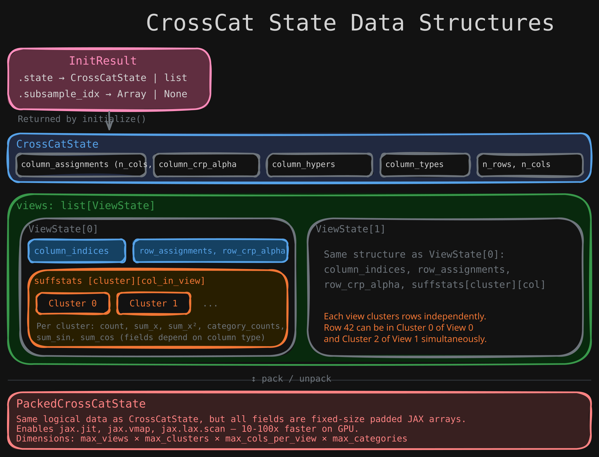
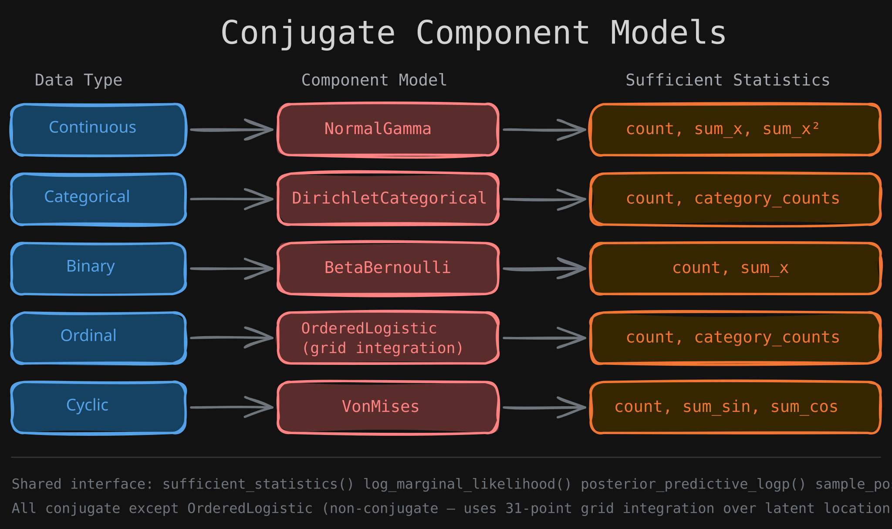

# The CrossCat Model

## Two-Level Dirichlet Process

CrossCat is a **two-level Dirichlet Process mixture model** for heterogeneous tabular data:

1. **Outer DP** (column partition): A Chinese Restaurant Process assigns each column to a "view." Columns in the same view are modeled as dependent; columns in different views are independent.

2. **Inner DP** (row clustering): Within each view, another CRP independently clusters rows. Each cluster maintains sufficient statistics for its columns.

3. **Component models**: Each (cluster, column) pair uses a conjugate Bayesian model. Parameters are analytically integrated out — only cluster assignments and hyperparameters are stored.

  

### Why Two Levels?

Consider a dataset with salary, experience, zip code, and commute columns. A single clustering would try to find groups where all four columns are correlated. But salary/experience correlate differently than zip/commute — they have different clustering structures.

CrossCat solves this by:

- Grouping `{salary, experience}` into View 0 with its own row clustering
- Grouping `{zip, commute}` into View 1 with a different row clustering
- Row 42 can be "Senior" in View 0 and "Urban" in View 1 independently

## State Structure

  

The full state contains:

- **Column assignments** — which view each column belongs to
- **Per-view row assignments** — which cluster each row belongs to (independent per view)
- **CRP concentration parameters** — controls how many groups to expect
- **Column hyperparameters** — a few scalars per column type
- **Sufficient statistics** — derived from data + assignments (count, sum, sum-of-squares, etc.)

## Collapsed Inference

All component model parameters are integrated out analytically. The sufficient statistics are enough to compute:

- **Log marginal likelihood**: \\( p(\text{data in cluster} \mid \text{hypers}) \\) — used for scoring
- **Posterior predictive**: \\( p(x_{\text{new}} \mid \text{data in cluster}, \text{hypers}) \\) — used for queries

This means the state only stores cluster assignments, hyperparameters, and sufficient statistics. No per-observation parameters. This is why CrossCat scales well.

## Component Models

  

Each column type uses a conjugate Bayesian model:

| Type | Model | Conjugate? | Sufficient Statistics |
|------|-------|------------|----------------------|
| CONTINUOUS | Normal-Gamma | Yes | count, sum_x, sum_x_sq |
| CATEGORICAL | Dirichlet-Categorical | Yes | count, category_counts |
| BINARY | Beta-Bernoulli | Yes | count, sum_x |
| ORDINAL | Ordered Logistic | No (grid integration) | count, category_counts |
| CYCLIC | Von Mises | Yes | count, sum_sin, sum_cos |

The Ordered Logistic model is the exception — it uses 31-point grid integration over a latent location parameter instead of conjugate updates.
