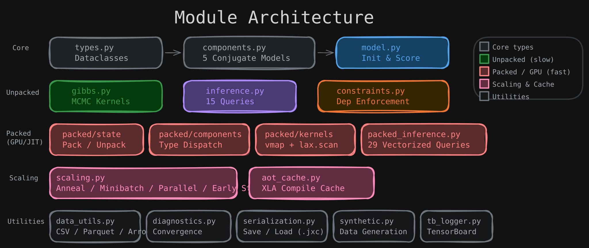

# Architecture Overview

This section explains the internal design of jax-crosscat: how the CrossCat model maps to JAX, how modules fit together, and the performance optimizations that enable GPU-scale inference.

## Pipeline

  

## Module Map

  

| Module | Purpose |
|--------|---------|
| `types.py` | State dataclasses: `CrossCatState`, `ViewState`, `SufficientStats`, `ColumnHypers` |
| `components.py` | Conjugate models: `NormalGamma`, `DirichletCategorical`, `BetaBernoulli`, `OrderedLogistic`, `VonMises` |
| `model.py` | `initialize()`, `log_joint()`, `insert_rows()` |
| `gibbs.py` | MCMC kernels: row/column assignments, hyperparameters, CRP alphas |
| `inference.py` | Posterior queries: predictive sampling, anomaly detection, MI, imputation, similarity |
| `packed/state.py` | JIT-compatible padded state (`PackedCrossCatState`, `pack_state`, `unpack_state`) |
| `packed/components.py` | Unified scoring via `jnp.where` type dispatch |
| `packed/suffstats.py` | Vectorized sufficient statistics via matrix ops |
| `packed/kernels.py` | JIT-compiled Gibbs kernels via `vmap`/`lax.scan` |
| `packed/aot_cache.py` | XLA persistent compilation cache |
| `packed_inference.py` | Vectorized inference queries on packed state |
| `constraints.py` | Column/row dependency constraint enforcement |
| `diagnostics.py` | ARI, convergence metrics, held-out evaluation |
| `serialization.py` | Save/load states and checkpoints (`.jxc` format) |
| `synthetic.py` | Synthetic data generation |
| `data_utils.py` | CSV I/O, column type detection |
| `validate.py` | State consistency checking |

## Data Flow

1. **`initialize()`** creates a `CrossCatState` by sampling from CRP priors and computing data-driven hyperparameter defaults.

2. **`pack_state()`** converts to fixed-size padded arrays for JIT compilation.

3. **`packed_gibbs_sweep()`** runs compiled Gibbs kernels (row assignments → column assignments → hyperparameters → CRP alphas).

4. **`unpack_state()`** converts back to Python-friendly state for queries and inspection.

5. **Queries** read the posterior state to answer questions via mixture-weighted posterior predictives.

## Sections

- [The CrossCat Model](model.md) — two-level DP, collapsed inference, component models
- [Gibbs Kernels in Detail](gibbs-kernels.md) — row/column/hyper kernel algorithms
- [Packed State Design](packed-state.md) — why padding enables JIT, pytree registration
- [Performance Optimizations](performance.md) — vectorized scoring, type specialization, 12x speedup
- [JAX Design Patterns](jax-patterns.md) — deterministic RNG, NaN transparency, immutability
