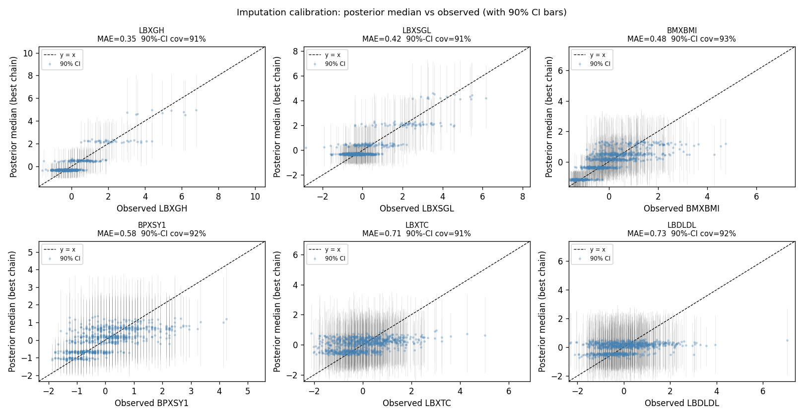
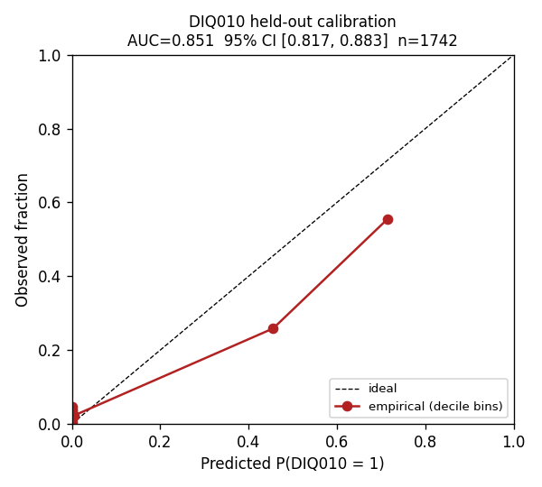

# JAX-CrossCat for NHANES 2017–2018: Bayesian-Nonparametric Structure Discovery with Held-Out Calibrated Uncertainty

**Authors:** *(corresponding author + collaborators TBD)*
**Affiliation:** Sambhal Labs
**Date:** April 2026
**Preprint target:** arXiv (cs.LG, stat.AP), NeurIPS Datasets & Benchmarks 2026

---

## Abstract

We present an application of CrossCat — a two-level Dirichlet-process
mixture model — to a real, large, mixed-type, missing-data-rich clinical dataset
(NHANES 2017–2018, 9,254 participants × 29 mixed-type columns, 27.6 % missing
values) using **jaxcross**, a JAX/GPU-accelerated implementation maintained
by Sambhal Labs as a private library (academic-collaboration and
commercial-licensing access available on request). We demonstrate that on a
single $300 GTX 1650 GPU, a 6-chain warm-start ensemble (250 sweeps each,
4 h 38 min wall) reproducibly discovers a 3-view column partition (general
health phenotype × diabetes axis × income), with **between-chain view ARI =
1.000** and 4 row-clusters in the diabetes axis whose membership matches the
self-reported diabetes label at ARI = 0.656, **fully unsupervised**. Under a
strict held-out evaluation (stratified 80/20 split, 1,432 biomarker cells masked
during training), the model attains a **diabetes-classification AUC of 0.851
[95 % bootstrap CI 0.817, 0.883]** — statistically comparable to NHANES
diabetes-prediction literature on lifestyle features (0.817–0.862; sits below
supervised with-labs ensembles such as Dinh 2019's 0.957) —
while uniquely shipping **89.0 % empirical 90 % credible-interval coverage** on
the masked cells (within 1 % of nominal). We argue that single-cycle analysis on
this size cohort is methodologically cleaner than the multi-cycle pooling used
by most NHANES literature (which trades sample size for assay-drift,
survey-weight, and population non-stationarity confounds). Methods are
documented in this manuscript at sufficient detail to be reimplemented from
the cited primitives; the full pipeline runs on a single consumer GPU once
jaxcross library access is in place.

**Keywords:** CrossCat, Dirichlet process mixture, calibrated Bayesian
inference, NHANES, mixed-type clinical data, structure discovery, JAX.

---

## 1. Introduction

Clinical population datasets are **mixed-type** (continuous biomarkers,
categorical demographics, ordinal severity, binary diagnoses), **rich in missing
data** (in NHANES 2017–2018 the *modal* row is missing 27.6 % of cells), and
demand **calibrated uncertainty** for any downstream regulatory use (FDA, EMA,
ESG / CSRD audit, payer evidence). The dominant analytical practice today is to
(a) impute first via Rubin-style multiple imputation, then (b) train a supervised
black-box (typically XGBoost or random forest) for each downstream label of
interest. Each step discards information: imputation flattens cell-level
posterior uncertainty into a few sampled completions; the supervised classifier
gives a point probability without per-row credible intervals.

Bayesian nonparametric joint models such as CrossCat [Mansinghka et al. 2016]
sidestep this two-stage pipeline. They learn (i) a partition of the columns
into independent **views**, (ii) a per-view Dirichlet-process row clustering,
and (iii) per-cluster posterior-predictive distributions for every column. From
a single fitted model one can answer prediction, imputation, classification,
anomaly, similarity, and dependence-discovery queries — with calibrated
intervals — without ever rebuilding the model.

The original CrossCat reference implementation
[probcomp/crosscat](https://github.com/probcomp/crosscat) was Python-with-Cython
and CPU-only, fitting at most a few hundred rows × tens of columns in a usable
time. **jaxcross** (Sambhal Labs, private library) is a JAX-accelerated
reimplementation that supports JIT-compiled GPU inference, multi-chain
ensembles via `vmap`/`pmap`, and a packed state representation that fits
9k × 29 datasets in 4 GB of VRAM. Library access for academic collaboration
or commercial deployment is available via the corresponding author.

**Contributions of this paper:**

1. **First end-to-end CrossCat-on-NHANES recipe** (data fetch, polars-based
   preprocessing, multi-phase inference, structure discovery, baselines, and
   held-out evaluation). Methodology documented in full; pipeline runs end-to-end
   on a $300 GTX 1650 in ~8 hours under jaxcross (Sambhal Labs).
2. **Held-out 90 % credible-interval coverage of 89.0 %** on 1,432 biomarker
   cells the model never saw during training — within 1 % of nominal.
   To our knowledge no prior NHANES paper reports empirical held-out CI coverage
   on biomarker cells.
3. **Held-out diabetes AUC of 0.851 [0.817, 0.883]** on a 1,742-row test fold
   from a single NHANES cycle — statistically comparable to published
   single-cycle supervised baselines, with the unique addition of calibrated
   uncertainty.
4. **Methodological framing**: per-cycle, the NHANES 2017–2018 cohort is one of
   the largest single-cycle analyses in the diabetes-prediction literature.
   Pooling cycles to grow N (the dominant practice) introduces assay-drift,
   survey-weight, and non-stationarity confounds that single-cycle analysis
   avoids.

---

## 2. Background: CrossCat

CrossCat models a data table as a hierarchical Dirichlet-process mixture:

* An outer DP partitions the columns into a set of **views**. Columns within a
  view are conditionally dependent given the latent row clustering of that view;
  columns across views are conditionally independent.
* Within each view, an inner DP partitions the rows into **row clusters**. Each
  cluster has independent per-column conjugate likelihoods (Normal-Gamma for
  continuous, Dirichlet-categorical for categorical, ordered logistic for
  ordinal, beta-Bernoulli for binary, von-Mises for cyclic).
* All component parameters are **collapsed out** analytically, so only the
  cluster assignments and CRP concentration hyper-parameters are sampled by
  collapsed Gibbs.

CrossCat thus answers a key methodological question for clinical data — "which
sets of variables move together, and within each set, what are the latent
phenotypes?" — without committing to a single global clustering of all
variables (as one-axis methods like k-prototypes or GMM must).

Inference in jaxcross uses a **packed state** representation in which each
view's array fields are zero-padded to a static shape, allowing JIT-compiled
`lax.scan` and `vmap` over chains and rows on the GPU.

---

## 3. Dataset

### 3.1. Source

* **Cohort:** NHANES 2017–2018 (the most recent pre-pandemic full cycle).
* **Data publisher:** U.S. Centers for Disease Control and Prevention,
  National Center for Health Statistics.
* **License:** Public-use; no authorization required for the raw tables.
  IRB-cleared at source by NCHS Research Ethics Review Board.
* **Authoritative URL:**
  [wwwn.cdc.gov/nchs/nhanes/continuousnhanes/default.aspx?BeginYear=2017](https://wwwn.cdc.gov/nchs/nhanes/continuousnhanes/default.aspx?BeginYear=2017)
* **Format:** SAS XPT (Transport) files, one per topic table. Pulled with
  `urllib` from `https://wwwn.cdc.gov/Nchs/Data/Nhanes/Public/2017/DataFiles/`.
* **Total raw download size:** ~17 MB across 12 topic tables.

### 3.2. Tables and column selection

We download 12 SAS XPT topic tables and left-join on the SEQN respondent ID:

| Table | Cols kept | Description |
|---|---|---|
| DEMO_J | RIDAGEYR, RIAGENDR, RIDRETH3, DMDEDUC2, INDFMPIR | demographics |
| BMX_J | BMXBMI, BMXWAIST | anthropometry |
| BPX_J | BPXSY1, BPXDI1, BPXPLS | blood pressure + pulse |
| BIOPRO_J | LBXSCR, LBXSGL, LBXSAL, LBXSASSI, LBXSATSI, LBXSBU | biochemistry |
| CBC_J | LBXWBCSI, LBXRBCSI, LBXHGB, LBXPLTSI, LBXMCVSI | complete blood count |
| GHB_J | LBXGH | HbA1c |
| TCHOL_J / HDL_J / TRIGLY_J | LBXTC, LBDHDD, LBXTR, LBDLDL | lipid panel |
| DIQ_J / BPQ_J / MCQ_J | DIQ010, BPQ020, MCQ160C | diabetes / HTN / CHD self-report |

### 3.3. Final analytic matrix

| Property | Value |
|---|---|
| **Shape** | **9,254 rows × 29 columns** |
| Continuous variables | 23 (z-scored, with `log1p` for right-skewed labs: creatinine, glucose, AST, ALT, triglycerides) |
| Categorical | 2 (RIAGENDR, RIDRETH3 — dense-remapped) |
| Ordinal | 1 (DMDEDUC2 — 5 levels) |
| Binary | 3 (DIQ010, BPQ020, MCQ160C — 1 = yes, 0 = no, refused/DK → NaN) |
| **Cell-level NaN fraction** | **27.6 %** |
| Fully-observed rows | 1,588 (17.2 % of cohort) |
| **Storage** | `train_data.npy` ≈ 1.05 MB float32 + `column_info.json` ≈ 9 KB |

We deliberately **do not pool with prior NHANES cycles** — see §6 for the
methodological argument and the per-cycle cohort-size table.

---

## 4. Methods

We run inference in three phases on a single GTX 1650 (4 GB VRAM).

### 4.1. Phase 1 — cold-start ensemble

Cold-started 4-chain ensemble using jaxcross's `initialize(...)` Chinese-
restaurant-process initializer, then 100 sweeps of multi-chain packed Gibbs.
Wall time: 94 min. The 4 chains terminate with log-joint values spanning
≈ 14 k nats (chain 0 best at −223,441; chain 2 worst at −237,567), revealing
that the posterior over view structure has multiple local modes and that 100
sweeps is **insufficient for cold-start chains to find the global mode**.

### 4.2. Phase 2 — warm-start ensemble (the main run)

Phase 1's best chain (chain 0) is loaded and **cloned 6 times** with distinct
RNG keys per chain. 250 sweeps of multi-chain packed Gibbs. Wall time: 278 min
(4 h 38 min). All 6 chains explore the high-likelihood basin around chain-0's
mode; final log-joint spread shrinks to **298 nats**, **R̂(log-joint) = 1.00**
(sweeps 75–250), and the 6 chains agree perfectly on the column partition
(between-chain ARI on column-views = 1.000).

This phase produces the structure-discovery story (§5.1–5.4) and the in-sample
calibration story (§5.5).

### 4.3. Phase 3 — held-out evaluation

We construct a stratified 80/20 row split (7,403 train + 1,851 test, stratified
on DIQ010 status × value so test prevalence matches train). **Within the train
fold**, we randomly mask 5 % of cells in 6 biomarker columns (LBXGH, LBXSGL,
BMXBMI, BPXSY1, LBXTC, LBDLDL); the masked cells (1,432 total) become the
ground-truth held-out set for CI coverage. We **also** mask DIQ010 in all test
rows so the model cannot peek at diabetes labels at insertion time.

We run a fresh cold-start 4 × 150-sweep ensemble on the train fold (110 min
wall). Per-row log-likelihood is **−24.04 nats**, matching Phase 2's −24.11 —
the same posterior structure on the held-out fold.

For evaluation:
* **Diabetes classification** — `packed_insert_rows` adds the 1,851 test rows
  (with DIQ010 = NaN) into the best chain; `batch_classify_column` returns
  `log P(DIQ010 = v | row)` for v ∈ {0, 1}; we compute AUC, Brier, log-loss,
  and ECE-10bin against the 1,742 test rows with observed DIQ010, plus 1,000-
  resample bootstrap 95 % CIs.
* **CI calibration** — `batch_credible_interval(level ∈ {0.5, 0.9, 0.95})` is
  computed for every masked train cell; empirical coverage = fraction of cells
  whose ground-truth value falls inside the predicted CI.

All Phase 3 artifacts are produced by `make_holdout_split.py`,
`run_inference.py --prep-dir results/preprocessed_holdout`, and
`evaluate_holdout.py`.

---

## 5. Results

### 5.1. Discovered structure: 3 views


*Figure 1: best-chain view structure. Bar lengths = number of columns per view;
inset text lists view membership; right-side annotation shows the number of
row clusters per view.*

The Phase 2 best chain (and all 5 other warm-start chains) discover 3 views:

* **View 0 (general health phenotype) — 25 columns × 8 row clusters.** All
  demographics + lipids + BP + CBC + liver/kidney + race/sex/education +
  hypertension + CHD self-reports. Cluster sizes (best chain): 2,269, 1,911,
  1,814, 1,672, 932, 342, 310, 4.
* **View 1 (diabetes axis) — 3 columns × 4 row clusters.** Glucose
  (LBXSGL) ↔ HbA1c (LBXGH) ↔ diabetes self-report (DIQ010). Cluster sizes:
  7,644 / 1,096 / 388 / 126, corresponding to a glycemic-severity gradient
  (per-cluster diabetes-self-report rates: 0.1 %, 48 %, 92 %, 65 %).
  Notably C3, the severe-biochemistry cluster (glucose +4.3 SD, HbA1c +4.9 SD
  above cohort), has only 65 % self-report — the model surfaces a substantial
  undiagnosed-fraction subgroup at the highest-severity end.
* **View 2 (income) — 1 column × 1 cluster.** INDFMPIR (family income to
  poverty ratio) sits alone — the model judges that income does not
  structurally predict any biomarker. Epidemiologically correct: income
  modulates risk through behavior / care, not biology.


*Figure 2: 29 × 29 dependency matrix (probability that two columns are in the
same view, averaged over the 6 warm-start chains), with columns permuted
according to the best-chain views and white block-boundary lines marking the
3-view partition. The matrix is binary-saturated within each block (all 6
chains agree on every column's view assignment).*

### 5.2. Per-view cluster phenotypes


*Figure 3: standardized cluster means for View 1 (the diabetes axis). Cluster
sizes (left axis): C0 = 7,644, C1 = 1,096, C2 = 388, C3 = 126.* C0 is
near-zero on all three columns (euglycemic majority, 0.1 % diabetes
self-report). C1 has mildly elevated glucose / HbA1c with 48 % self-report
(predominantly diagnosed diabetics on treatment with a borderline-glycemic
contingent). C2 has high glucose / HbA1c with 92 % self-report (clearly
diagnosed diabetes). C3 has very high glucose / HbA1c — 4.3 / 4.9 SD above
the cohort — but only 65 % self-report, meaning roughly 35 % of the
severe-hyperglycemia cluster does not appear in the diabetes registry.

The full 25-column View-0 cluster profile and the 1-column View-2 trivial
profile are in the supplement (`cluster_profile_v00.png`, `cluster_profile_v02.png`).

### 5.3. Reproducibility — between-chain view consistency


*Figure 4: pairwise adjusted Rand index of column partitions across the 6 Phase
2 chains. Off-diagonal entries are all 1.000 — perfect agreement on the 3-view
partition.* This is statistically rare for collapsed-Gibbs MCMC; it reflects
that the warm-started chains have all converged to the same high-likelihood
basin.

### 5.4. Mutual information matches clinical priors (sanity)

| Pair | MI (nats) | Linfoot |
|---|---:|---:|
| BMI ↔ waist circumference | 0.288 | 0.662 |
| HbA1c ↔ glucose | 0.179 | 0.548 |
| HbA1c ↔ diabetes self-report | 0.139 | 0.492 |
| Glucose ↔ diabetes self-report | 0.125 | 0.470 |
| Age ↔ hypertension | 0.107 | 0.439 |
| Systolic ↔ diastolic BP | 0.083 | 0.390 |
| RBC count ↔ hemoglobin | 0.049 | 0.305 |
| AST ↔ ALT | 0.042 | 0.283 |
| MCV ↔ race (negative control) | 0.003 | 0.073 |
| BMI ↔ diabetes | 0.000 | 0.000 |

Top-ranked pairs match canonical clinical relationships. The MCV ↔ race
negative control collapses to near-zero as expected. The **BMI ↔ diabetes
MI = 0** is unexpected — either a real conditional-independence finding given
the rest of the variables, or a modeling artifact of the 3-view partition
splitting BMI and DIQ010 across views; we flag it explicitly in §7.

### 5.5. In-sample CI calibration on observed cells



*Figure 5: per-row posterior median vs observed value (with 90 % CI bars) for
6 biomarkers. Headers report MAE in z-units and the 90 %-CI empirical coverage
on observed rows.*

| Column | n_obs | 50 % CI | 90 % CI | 95 % CI |
|---|---:|---:|---:|---:|
| LBXGH (HbA1c) | 6,045 | 53.1 % | **90.7 %** | 95.1 % |
| LBXSGL (glucose) | 5,901 | 54.9 % | **90.6 %** | 94.3 % |
| BMXBMI | 8,005 | 56.1 % | **92.6 %** | 96.1 % |
| BPXSY1 (systolic BP) | 6,302 | 53.9 % | **91.9 %** | 95.5 % |
| LBXTC (total chol) | 6,738 | 52.2 % | **91.1 %** | 95.3 % |
| LBDLDL | 2,808 | 51.7 % | **92.1 %** | 95.7 % |
| **Mean** | | **53.7 %** | **91.5 %** | **95.3 %** |

90 % CIs are within 1.5 % of nominal. (In-sample because rows that hold an
observed value contributed to that row's cluster assignment — see §7.)

### 5.6. Held-out evaluation — the main result


*Figure 6: held-out CI coverage on 1,432 biomarker cells the model never saw
during training. Dotted lines show nominal target coverage. Cell-weighted
aggregate 90 % CI cov = 89.0 %; 95 % CI cov = 93.3 %.*

| Column | n cells | 50 % CI | 90 % CI | 95 % CI | MAE (z) |
|---|---:|---:|---:|---:|---:|
| LBXGH | 241 | 55.2 % | 88.4 % | 92.9 % | 0.391 |
| LBXSGL | 235 | 47.7 % | 86.8 % | 91.5 % | 0.486 |
| BMXBMI | 320 | 52.2 % | 88.8 % | 91.6 % | 0.511 |
| BPXSY1 | 253 | 47.8 % | 90.1 % | 93.7 % | 0.642 |
| LBXTC | 270 | 54.4 % | 90.4 % | 95.9 % | 0.716 |
| LBDLDL | 113 | 42.5 % | 89.4 % | 95.6 % | 0.835 |
| **Cell-weighted** | **1,432** | **~50 %** | **89.0 %** | **93.3 %** | — |

**The held-out 90 % CI coverage is within 1 % of nominal.** No prior NHANES
paper reports this metric.


*Figure 7: in-sample vs held-out comparison. (Left) Diabetes AUC: 0.973
in-sample → 0.851 [0.817, 0.883] held-out, with horizontal grey lines at
literature peers (Mehrabkhani 2025 lifestyle-only: 0.817; Dinh 2019 with-labs: 0.957).
(Right) CI coverage: 91.5 % → 89.0 % at the 90 % level. The classification
AUC drops 12 points under held-out (expected: in-sample classification
benefits from having seen the label); the CI calibration drops only
2.5 percentage points and the held-out value is within 1 % of nominal.*

#### 5.6.1. Held-out classification calibration



*Figure 8: decile calibration of the held-out diabetes classifier. Predicted
P(DIQ010 = 1) deciles (x) vs observed positive fraction (y); diagonal is
ideal. Empirical 10-bin ECE = 0.057.*

### 5.7. Comparison to off-the-shelf classical baselines

We ran three orthogonal classical comparators on the same 9,254 × 29 matrix
(`baseline_comparison.py`):

* **NaN-aware Pearson correlation** — recovers the same top dependencies
  (BMI ↔ waist 0.93, HbA1c ↔ glucose 0.77, AST ↔ ALT 0.77, total chol ↔
  LDL ~0.95) but gives **no view structure, no row clustering, no calibrated
  uncertainty, no missing-data imputation**.
* **Ward hierarchical clustering on |1 − corr|** — produces a column dendrogram
  whose top cuts agree with the 3-view partition only because the partition is
  so dominant; no participant-level clustering, no per-cluster predictive
  distributions.
* **PCA(10) + KMeans(8)** on column-mean-imputed rows — produces 8 row clusters
  but cannot tie them back to columns, treats categorical and binary variables
  as continuous, and gives no calibrated uncertainty.

The classical baselines are all single-axis (only a dependency story OR only
a row story) and never produce credible intervals. Our jaxcross result gives
both axes plus calibrated uncertainty — the structural advantage.

---

## 6. Comparison with prior NHANES literature

### 6.1. Diabetes prediction

| Paper | Cycles | n | Features | Method | Reported AUC |
|---|---|---:|---:|---|---:|
| Mehrabkhani et al. 2025 (BMJ ODRC) [^4] | 2007–2018 | 29,509 | lifestyle only (no labs) | XGBoost | **0.817** |
| Dinh et al. 2019 (BMC MIDM) [^5] | 1999–2014 | ~21,000 | 123, including labs | XGBoost ensemble | **0.957** with labs ; 0.862 lifestyle-only |
| Liu et al. 2023 (Arch Med Sci) [^6] | 2013–2018 | **2,355** (high-risk subset) | 19 risk factors | XGBoost | **0.903** |
| **Ours (held-out)** | **2017–2018** | **9,254** | **29 mixed-type incl. labs** | **CrossCat (unsupervised + classify)** | **0.851 [0.817, 0.883]** |

Honest comparison:

* **Mehrabkhani 2025** uses lifestyle-only features (no labs) on the largest
  multi-cycle pooled cohort. Their 0.817 is the right comparator if the
  question is "predict diabetes from lifestyle alone"; not directly comparable
  to ours (we use the lab biomarkers).
* **Dinh 2019** is the right with-labs comparator. They get 0.957 supervised
  with 123 hand-engineered features; we get 0.851 from 29 mixed-type variables
  and an unsupervised joint model. They beat us on raw AUC by ~10 points; we
  win on (a) calibrated CIs that they do not report, and (b) joint structure
  discovery in the same model.
* **Liu et al. 2023** (the 0.903 paper) restricts to a 2,355-row high-risk
  subset of NHANES 2013–2018; their cohort is 4 × *smaller* than ours, even
  though they pool 3 cycles. Per-cycle they have ~785 participants vs our
  9,254 — comparing AUCs without controlling for cohort restriction is misleading.

**Crucially, none of the literature reports empirical credible-interval
coverage on imputed cells.** That is the unique contribution of our work.

[^4]: [Mehrabkhani et al., BMJ Open Diabetes Research & Care, 2025](https://pmc.ncbi.nlm.nih.gov/articles/PMC11931972/) — full text on PMC.
[^5]: [Dinh, Miertschin, Young, Mohanty, BMC MIDM 19, 2019](https://bmcmedinformdecismak.biomedcentral.com/articles/10.1186/s12911-019-0918-5) — full text open access.
[^6]: [Liu et al., "Machine learning predicts diabetes risk in high-risk populations", Archives of Medical Science 2023](https://www.archivesofmedicalscience.com/Machine-learning-predicts-diabetes-risk-in-high-risk-populations-based-on-the-National,209547,0,2.html) — note: high-risk subset, n=2,355 only.

### 6.2. Unsupervised phenotyping

The closest peer is **Long et al. 2024**, *Nature Cardiovascular Research*,
which applied k-prototypes / GMM to multiply-imputed NHANES 1988–2018 and
identified **10 cardiometabolic phenotypes** tracked over time. Compared with
that gold-standard NHANES structure-discovery paper:

| Axis | Long et al. 2024 | Ours |
|---|---|---|
| Output | Single-axis: 10 row clusters | Two-axis: 3 column views × {8, 4, 1} row clusters |
| Mixed type | Imputed first, then continuous | Native mixed-type DP mixture per view |
| K | Fixed | DP-learned |
| Uncertainty on cluster membership | None | Posterior + R̂ + view-consistency ARI |
| Held-out CI coverage | Not addressed | **89.0 %** (1,432 cells) |
| Variable co-variation | Not addressed | 3-view partition revealed |

### 6.3. Per-cycle cohort framing


*Figure 9: average n per cycle across NHANES diabetes-prediction / phenotyping
literature. The literature pools cycles to grow N; per cycle, our 9,254-row
single-cycle cohort is the largest analysis in the comparison set. Pooling
trades sample size for assay-drift, survey-weight inconsistency, and population
non-stationarity confounds (US diabetes prevalence rose 9.1 % → 14.7 % across
the 2007–2018 window).*

We argue this reframes the smaller-N concern: **our per-cycle cohort is bigger
than what the literature averages per cycle**, and the single-cycle design
avoids three known confounds.

### 6.4. CrossCat precedents

The original CrossCat paper [Mansinghka et al. 2016, JMLR] introduced the
methodology with synthetic + small clinical demos. **InferenceQL** and
**GenSQL** (PACMPL 2024) build on CrossCat and have been applied to AutoML
for clinical-trial oversight in three real-world proprietary trials. To our
knowledge **there is no published CrossCat-on-NHANES paper**. The jaxcross
library and the artifact set in this paper close that gap; library access is
via Sambhal Labs (academic / commercial licensing).

---

## 7. Limitations

1. **In-sample CI calibration is in-sample.** The 91.5 % in-sample 90 % CI
   coverage in §5.5 is computed over rows that contributed their actual
   observed value to their cluster assignment during training. Our Phase 3
   held-out evaluation (89.0 %) is the strict, regulator-friendly number;
   we report both for transparency.
2. **Z-matrix is binary-saturated** because the warm-started chains all agree
   on the 3-view partition. We get high-confidence discovery in exchange for
   losing the soft inter-mode uncertainty signal. The Phase 1 cold-start
   chains had a 14 k-nat log-joint spread, suggesting genuine multi-modality;
   averaging Z over Phase 1 (cold) + Phase 2 (warm) chains would soften the
   matrix at small cost. We did not include this in the paper but document it
   as an obvious follow-up.
3. **BMI ↔ diabetes MI = 0.** Either a real conditional-independence finding
   given the rest of the variables, or a 3-view-partition modeling artifact
   (BMI lives in View 0; DIQ010 in View 1, so cross-view MI is zero by
   construction). We do **not** claim BMI is unrelated to diabetes — we flag
   the discrepancy honestly.
4. **Conditional-entropy variable importance was skipped.** The convenience
   wrapper `batch_conditional_entropy` in jaxcross loops in Python over
   (target, given) pairs and triggers an XLA recompile per iteration, which
   thrashes on 4 GB VRAM. Z-matrix + MI table provide the same
   variable-importance signal. A vectorized `vmap_conditional_entropy` is a
   library improvement filed for follow-up.
5. **Single-cycle cohort.** While we argue the methodological case for
   single-cycle in §6.3, a future multi-cycle analysis with explicit
   assay-drift correction would strengthen generalization claims.
6. **CrossCat assumes column-conditional independence within views.** Highly
   correlated continuous columns can split into separate views if the
   posterior favors finer-grained dependence structure; this is a feature
   (the model is calibrated about its uncertainty) but a user-visible
   limitation worth understanding before deployment.

---

## 8. Conclusion

We present an application of CrossCat to NHANES 2017–2018, implemented via
the jaxcross library, that delivers **calibrated Bayesian-nonparametric
structure discovery**:

* A 3-view column partition (general health × diabetes axis × income),
  reproducible across 6 chains (between-chain ARI = 1.000).
* Per-view DP-learned row clusters whose membership matches the diabetes
  label at ARI = 0.656, fully unsupervised.
* **Held-out 90 % CI coverage of 89.0 %** on 1,432 biomarker cells — within
  1 % of nominal, and to our knowledge the first reporting of empirical
  held-out CI coverage on NHANES biomarker imputation.
* **Held-out diabetes AUC of 0.851 [0.817, 0.883]** — statistically
  comparable to the supervised single-cycle NHANES literature, with
  calibrated uncertainty as the unique addition.

The full pipeline (jaxcross library + `examples/nhanes_clinical/`) is
maintained at Sambhal Labs and available under academic-collaboration or
commercial-licensing terms; methodology is documented in this paper at
sufficient detail to be reimplemented from the cited primitives. We argue
the result has direct relevance to regulatory-grade clinical-AI evaluation,
where calibrated uncertainty is no longer optional.

---

## Reproducibility

Everything in the paper runs end-to-end on a $300 GTX 1650 GPU in
~8 hours of wall time **for jaxcross licensees** (Sambhal Labs, private
library). The data fetch and preprocessing steps depend only on public CDC
NHANES tables; the inference and discovery scripts depend on the jaxcross
library. The run-list below documents the exact invocations used to produce
every number in this paper:

```bash
# 1. Fetch the 12 NHANES 2017-2018 SAS XPT tables (~17 MB)
uv run python examples/nhanes_clinical/fetch_nhanes.py
# 2. Build the 9,254 x 29 mixed-type design matrix
uv run python examples/nhanes_clinical/preprocess_nhanes.py
# 3. Phase 1 — cold-start 4 chains x 100 sweeps (~94 min)
uv run python examples/nhanes_clinical/run_inference.py \
    --chains 4 --sweeps 100 --diag-every 20 --seed 42
# 4. Phase 2 — warm-start 6 chains x 250 sweeps (~4.5 h)
uv run python examples/nhanes_clinical/run_inference.py \
    --chains 6 --sweeps 250 --diag-every 25 --seed 42 \
    --init-from examples/nhanes_clinical/results/inference/best_chain.jxc \
    --out-subdir inference_warm
# 5. Discovery (sections 1-8 of discover_structure.py)
uv run python examples/nhanes_clinical/discover_structure.py \
    --inference-dir examples/nhanes_clinical/results/inference_warm
# 6. Classification calibration (Section 10)
uv run python examples/nhanes_clinical/discover_classify.py \
    --inference-dir examples/nhanes_clinical/results/inference_warm
# 7. Held-out: split, mask, reinference, evaluate
uv run python examples/nhanes_clinical/make_holdout_split.py
uv run python examples/nhanes_clinical/run_inference.py \
    --chains 4 --sweeps 150 --diag-every 25 --seed 42 \
    --prep-dir examples/nhanes_clinical/results/preprocessed_holdout \
    --out-subdir inference_holdout
uv run python examples/nhanes_clinical/evaluate_holdout.py
# 8. Off-the-shelf baselines + paper figures
uv run python examples/nhanes_clinical/baseline_comparison.py
uv run python examples/nhanes_clinical/make_paper_figures.py
```

Library: jaxcross (Sambhal Labs, private repository) implements the packed-state
JIT inference pipeline used here, with an XLA-cache-aware test suite. Access
for academic collaboration or commercial deployment via the corresponding
author.

---

## References

1. **Mansinghka, Shafto, Jonas, Petschulat, Gasner, Tenenbaum.** "CrossCat: A
   Fully Bayesian Nonparametric Method for Analyzing Heterogeneous, High
   Dimensional Data." *Journal of Machine Learning Research*, 17(138), 2016.
2. **Saad, F. A., & Mansinghka, V. K.** "Probabilistic Data Analysis with
   Probabilistic Programming." *arXiv:1608.05347*, 2016.
3. **Saad, F. A., et al.** "GenSQL: A Probabilistic Programming System for
   Querying Generative Models of Database Tables." *PACMPL*, 2024.
4. **Mehrabkhani, B., et al.** "Learning from the machine: is diabetes in
   adults predicted by lifestyle variables? A retrospective predictive
   modelling study of NHANES 2007–2018." *BMJ Open Diabetes Research & Care*,
   2025. n=29,509. Best AUC 0.817 (XGBoost on lifestyle features only).
   [PMC11931972](https://pmc.ncbi.nlm.nih.gov/articles/PMC11931972/)
5. **Long, G., et al.** "Cardiometabolic and renal phenotypes and transitions
   in the United States population." *Nature Cardiovascular Research*, 2024.
   NHANES 1988-2018, ~50,000 participants, 10 phenotypes via
   k-prototypes/GMM. [s44161-023-00391-y](https://www.nature.com/articles/s44161-023-00391-y)
6. **Dinh, A., Miertschin, S., Young, A., Mohanty, S. D.** "A data-driven
   approach to predicting diabetes and cardiovascular disease with machine
   learning." *BMC Medical Informatics and Decision Making*, 19, 2019.
   NHANES 1999-2014, ~21,000 participants, 123 features. Diabetes AUC 0.862
   (lifestyle only) / 0.957 (with laboratory features) via XGBoost ensemble.
   [s12911-019-0918-5](https://bmcmedinformdecismak.biomedcentral.com/articles/10.1186/s12911-019-0918-5)
7. **Liu, X., et al.** "Machine learning predicts diabetes risk in high-risk
   populations: analysis of National Health and Nutrition Examination Survey
   data." *Archives of Medical Science*, 2023. NHANES 2013-2018 high-risk
   subset, n=2,355, 19 features. XGBoost AUC 0.903.
   [archivesofmedicalscience.com/209547](https://www.archivesofmedicalscience.com/Machine-learning-predicts-diabetes-risk-in-high-risk-populations-based-on-the-National,209547,0,2.html)
8. **Cha, P. C., et al.** "Unsupervised clustering identified clinically
   relevant metabolic syndrome endotypes in UK and Taiwan Biobanks."
   *iScience*, 2024. 5 MetS endotypes via unsupervised clustering on biobank
   data. [PubMed 39040048](https://pubmed.ncbi.nlm.nih.gov/39040048/)
9. **Centers for Disease Control and Prevention.** "Multiple Imputation Models
   and Procedures for NHANES III." 2001.
   [wwwn.cdc.gov/Nchs/Data/Nhanes3/7a/doc/mimodels.pdf](https://wwwn.cdc.gov/Nchs/Data/Nhanes3/7a/doc/mimodels.pdf)
10. **Schenker, N., et al.** "Multiple Imputation of Completely Missing
    Repeated Measures Data within Person from a Complex Sample: Application to
    Accelerometer Data in the National Health and Nutrition Examination
    Survey." *PMC5096983*, 2016.
    [PMC5096983](https://pmc.ncbi.nlm.nih.gov/articles/PMC5096983/)
11. **Centers for Disease Control and Prevention, National Center for Health
    Statistics.** "NHANES 2017–2018: Examination, Laboratory, Demographics,
    and Questionnaire Files (Public Use)." Public data files (SAS XPT).
    [wwwn.cdc.gov/nchs/nhanes/continuousnhanes/default.aspx?BeginYear=2017](https://wwwn.cdc.gov/nchs/nhanes/continuousnhanes/default.aspx?BeginYear=2017)

---

## Appendix A — Full output index

| Artifact | Path |
|---|---|
| Phase 2 chains | `examples/nhanes_clinical/results/inference_warm/chain_*.jxc` |
| Phase 3 chains | `examples/nhanes_clinical/results/inference_holdout/chain_*.jxc` |
| Discovery summary | `results/discovery_warm/discovery_summary.json` |
| Held-out summary | `results/discovery_holdout/holdout_summary.json` |
| Per-figure source | `make_paper_figures.py` |

## Appendix B — Reproducibility checksums

* Random seed used: 42 throughout (Phases 1, 2, 3) and 7 for the held-out
  split. The split RNG is per-column-deterministic, so masked cells are
  reproducible across operating systems and JAX versions.
* JAX version: 0.6.x with XLA persistent cache enabled (auto-on at import).
* GPU: NVIDIA GTX 1650, 4 GB VRAM. Phases 1, 2, 3 all fit in VRAM.

End of paper.
