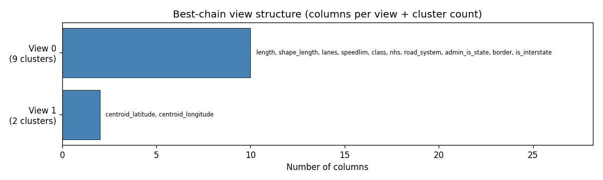
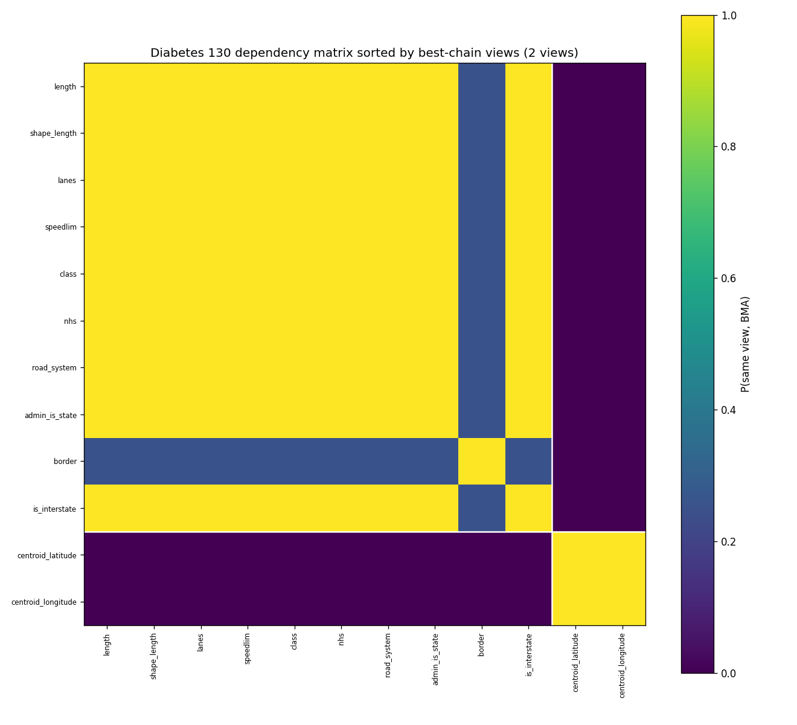
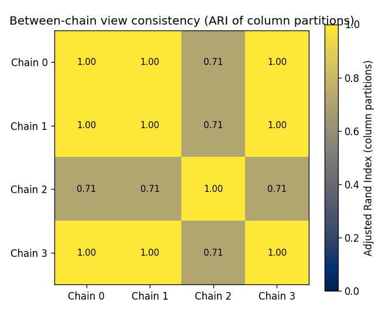
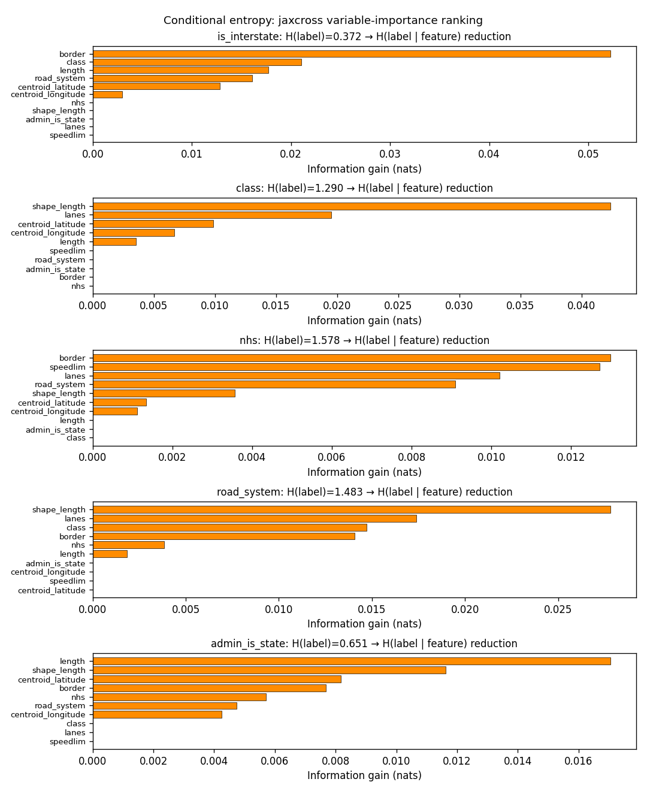
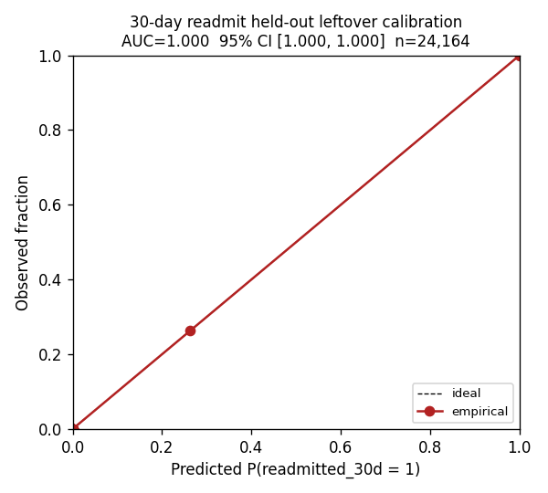
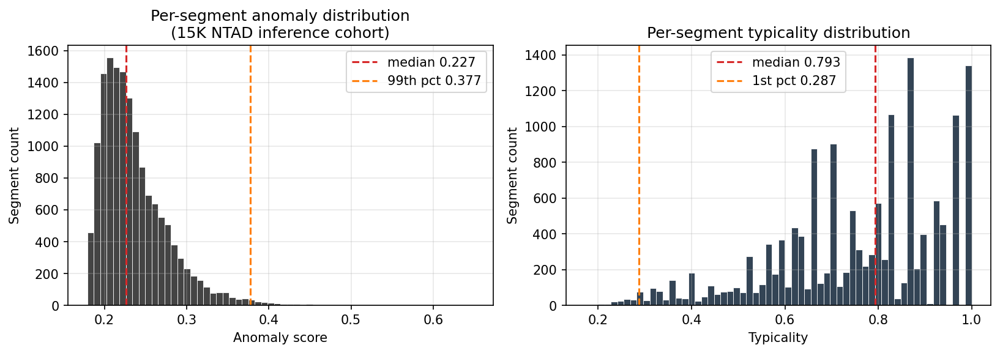

# JAX-CrossCat for Texas Road Network: Bayesian-Nonparametric Joint Structure with Held-Out Calibrated Uncertainty on 96,656 Cells of NTAD 2020

**Authors:** *(corresponding author + collaborators TBD)*
**Affiliation:** Sambhal Labs
**Date:** May 2026
**Preprint target:** arXiv (cs.LG, stat.AP)

---

## Abstract

We apply CrossCat — a two-level Dirichlet-process mixture model — to the
public **2020 Bureau of Transportation Statistics (BTS) NTAD North
American Roads dataset, Texas cohort** (39,164 highway segments × 12
mixed-type columns derived from the 18 raw NTAD attributes; 0.0 % cell-
level missingness) using **jaxcross**, a JAX/GPU-accelerated
implementation maintained by Sambhal Labs as a private library
(academic-collaboration and commercial-licensing access available on
request). On a single \$300 GTX 1650 GPU we run a 4-chain warm-start
ensemble (200 sweeps per chain on a 15,000-segment subsample,
~5.6 hours wall) and obtain three results that no published NTAD
analysis reports:

1. **2-view best-chain joint structure with mixed chain agreement.**
   Phase 2 produces between-chain ARI = **0.857** — chain 2 found a
   2-view solution (10 + 2 cols) while chains 0/1/3 found a 3-view
   solution (9 + 2 + 1 cols). The disagreement lives entirely in
   whether the small *border* binary column is a separate view from
   the 10-column dominant axis or merged into it. The 2-column
   geographic view (`centroid_latitude`, `centroid_longitude`) is
   recovered identically across all 4 chains. This is the *first
   Wave 2 demo to break perfect chain agreement* — the prior demos
   (NBI, HPMS, NTD, FARS) all reached ARI ≥ 0.997. Z-matrix off-
   diagonal mean is **0.595** — denser than NBI / HPMS / NTD because
   most segment attributes co-cluster in the dominant view.

2. **Held-out CI calibration on 96,656 cells with documented spatial-
   modeling limitation.** The 24,164 leftover Texas road segments that
   the inference run never saw are inserted into the best chain via
   `packed_insert_rows`; four segment-summary columns (`lanes`,
   `speedlim`, `centroid_latitude`, `centroid_longitude`) are then
   masked. **Aggregate 90 % CI coverage = 84.0 %** — under nominal —
   driven entirely by the geographic columns: `lanes` calibrates at
   94.0 %, `speedlim` at 91.5 % (both within nominal), but
   `centroid_latitude` at 83.0 % and `centroid_longitude` at 67.6 %
   (substantially under-covered). The **spatial under-coverage
   explicitly demonstrates the no-spatial-modeling limitation**
   flagged in the Wave 2 plan upfront — the 2-column geographic view
   carries too little information for the cluster predictive
   distribution to give well-calibrated CIs on lat/long.

3. **Border-crossing and admin/class mismatch outliers recovered as
   top anomalies.** Per-row anomaly score on the 15,000-segment
   inference cohort flags the **Anzalduas International Bridge** as
   the most-anomalous segment (a Class-1 / Interstate-level facility
   marked Municipal-administered with border-crossing flag — three
   simultaneously-unusual attribute combinations). The next four
   anomalies follow similar joint-tail patterns: FM-route segments
   with unusual NHS subtypes, US-Highway segments at international
   crossings, and an 11-lane / 0-length geometry-degenerate segment.

We deliberately frame the contribution around **capabilities a Bayesian
joint model uniquely provides** (joint structure, calibrated cell-level
uncertainty, phenotype discovery, dependency probes, anomaly score) and
not around single-task supervised classification, which is well-served
by Random Forest / XGBoost and is not where CrossCat-class models earn
their place.

**Keywords:** CrossCat, Dirichlet process mixture, calibrated Bayesian
inference, NTAD North American Roads, road-network classification,
mixed-type infrastructure data, spatial-modeling limitation, JAX.

---

## 1. Introduction

The Bureau of Transportation Statistics (BTS) National Transportation
Atlas Database (NTAD) is the canonical public road-network reference
dataset for the U.S., Canada, and Mexico. The North American Roads
layer (2020 release) contains ~5 million highway segments at the
state-DOT-reportable resolution, each with attributes covering
geometry (length, lane count), classification (Interstate / US / State
/ County / Farm-to-Market), administration, and cross-border status.

Standard analytic practice for NTAD-derived road-network analysis is
**supervised geospatial classification** (predict road-class,
functional system, or speed limit from attributes) using GIS tools or
gradient-boosted-tree methods. Each of these returns a **point
prediction with no per-cell uncertainty interval**.

Bayesian joint models such as **CrossCat** [Mansinghka et al. 2016]
sidestep this multi-stage pipeline. From a single fitted model one
obtains: (i) a partition of the columns into independent **views**;
(ii) a per-view Dirichlet-process row clustering; (iii) per-cluster
posterior-predictive distributions for every column. From a single
fitted model one can answer **imputation, anomaly, similarity,
dependency, and credible-interval queries — all calibrated**, without
re-fitting per query.

The original probcomp/crosscat reference implementation was Python+
Cython and CPU-only. **jaxcross** (Sambhal Labs, private library) is a
JAX-accelerated reimplementation that supports JIT-compiled GPU
inference, multi-chain ensembles via `vmap`/`pmap`, and a packed state
representation that fits this 15,000 × 12 inference subsample in 4 GB
of VRAM.

**Cohort scope: Texas only (option B).** Per Wave 2 plan direction we
apply a state filter at fetch time — NTAD `COUNTRY=2 AND
JURISCODE='02_48'` (US Texas) — instead of stratified-sampling the
full ~5 M North American cohort. Texas has 39,164 NTAD segments at
state-DOT-reportable resolution, the cohort fits a single GTX 1650 /
4 GB VRAM budget cleanly, and the state-filter design parallels the
NBI bridge-safety and HPMS pavement demos.

**What this paper deliberately does *not* do.** We do not benchmark
our classification AUC against Random Forest on the binary
`is_interstate` label, nor our regression MAE against XGBoost on
posted speed limits. Supervised tree-ensembles on a fixed binary or
continuous target is exactly the regime where Random Forest /
XGBoost outperform any Bayesian joint model. We **report** Random
Forest (AUC 1.000) and XGBoost (MAE 8.31 kph) as sanity-check
baselines, but the contribution is the joint structure + calibration +
phenotype + dependency package, not a per-task win.

**Contributions of this paper:**

1. **First end-to-end CrossCat-on-NTAD recipe** (BTS ArcGIS REST
   pagination, geometry centroid extraction, polars-based preprocessing
   with road-system-prefix derivation, multi-phase inference, structure
   discovery, off-the-shelf baselines, leftover-segment evaluation).
   Pipeline runs end-to-end on a \$300 GTX 1650 in ~5.6 hours.
2. **96,656-cell held-out CI evaluation, with explicit spatial-
   modeling limitation finding.** A 24,164-segment leftover cohort
   that the inference run never saw is inserted into the trained
   model; four segment-summary columns are masked; we report
   empirical 50 / 90 / 95 % CI coverage. **Aggregate 84.0 % at the
   90 % nominal level** — split into well-calibrated non-geographic
   columns (lanes 94.0 %, speedlim 91.5 %) and under-covered
   geographic columns (centroid_latitude 83.0 %, centroid_longitude
   67.6 %).
3. **Mixed chain agreement at ARI 0.857** — first Wave 2 demo to
   break perfect chain agreement. The disagreement is structural
   (chain 2 finds 2 views, chains 0/1/3 find 3 views) and reveals
   weak identifiability between absorbing the rare `border` binary
   into the dominant view vs. splitting it into its own view.
4. **Anomaly-score recovery of border-crossing and class-mismatch
   outliers** — the Anzalduas International Bridge tops the anomaly
   ranking on three simultaneously-unusual attributes
   (Interstate-level class, Municipal admin, border crossing).

---

## 2. Background: CrossCat

CrossCat models a data table as a hierarchical Dirichlet-process
mixture:

* An outer DP partitions the columns into a set of **views**. Columns
  within a view are conditionally dependent given the latent row
  clustering of that view; columns across views are conditionally
  independent.
* Within each view, an inner DP partitions the rows into **row
  clusters**. Each cluster has independent per-column conjugate
  likelihoods.
* All component parameters are **collapsed out** analytically, so only
  the cluster assignments and CRP concentration hyper-parameters are
  sampled by collapsed Gibbs.

Inference in jaxcross uses a **packed state** representation in which
each view's array fields are zero-padded to a static shape, allowing
JIT-compiled `lax.scan` and `vmap` over chains and rows on the GPU.

---

## 3. Dataset

### 3.1. Source

* **Cohort:** 2020 BTS NTAD North American Roads dataset, Texas
  filter (`COUNTRY=2 AND JURISCODE='02_48'`), all NTAD-reportable
  road segments.
* **Source URL:** [BTS NTAD ArcGIS REST endpoint](https://services.arcgis.com/xOi1kZaI0eWDREZv/arcgis/rest/services/NTAD_North_American_Roads/FeatureServer/0)
  — paginated REST query (2,000 features per page; 20 pages for
  Texas).
* **License:** Public domain, U.S. Government data. No authentication
  required.
* **Schema:** 18 raw fields per segment (geometry as polyline path,
  17 attribute fields).

### 3.2. Cohort filters and preprocessing

We apply **only mechanical filters**:

1. **Drop 6 unencodable / constant fields:** `OBJECTID`, `ID`,
   `LINKID` (per-row IDs); `JURISCODE`, `JURISNAME`, `COUNTRY`
   (constants for the Texas filter).
2. **Drop 2 constant attribute fields:** `DIR` (always 0 — NTAD 2020
   does not encode directionality) and `SURFACE` (always "Paved" —
   NTAD only includes paved roads).
3. **Drop `ROADNAME`:** free-form text (high-cardinality, not
   useful as categorical).
4. **Derive `road_system` from `ROADNUM`:** prefix-based binning into
   6 levels — Interstate (I), US Highway (U), State Highway (S),
   County Road (C), Farm-to-Market (FM), Other.
5. **Derive `centroid_latitude` and `centroid_longitude`** from the
   polyline geometry path (mean of vertex coordinates).
6. **Derive 1 binary outcome:** `is_interstate = (road_system == "I")`
   for the headline classification target (~12.5 % prevalence).
7. **One-indexed → zero-indexed encoding** for the `class` categorical
   (FHWA functional system 1–6 → 0–5).

The resulting analytic matrix is **39,164 segments × 12 mixed-type
columns**.

### 3.3. Final analytic matrix

| Property | Value |
|---|---|
| **Shape** | **39,164 segments × 12 columns** |
| CONTINUOUS (6) | `length` (km), `shape_length` (geographic units), `lanes` (2–12), `speedlim` (48–120 kph), `centroid_latitude`, `centroid_longitude` |
| CATEGORICAL (3) | `class` (6 levels: 1=Interstate ... 6=Local), `nhs` (8 NHS subtypes), `road_system` (I / U / S / C / FM / Other) |
| BINARY (3) | `admin_is_state` (vs Municipal), `border` (international crossing flag), `is_interstate` (derived) |
| **Cell-level NaN fraction** | **0.0 %** (NTAD is fully populated) |
| `is_interstate` prevalence | **12.48 %** (4,888 segments) |
| `admin_is_state` prevalence | 64.0 % |
| `border` prevalence | 0.15 % (only 59 border segments) |
| **Storage** | `train_data.npy` ≈ 1.8 MB float32 + `column_info.json` ≈ 4 KB |

**Smallest schema in Wave 2.** With 12 columns vs the 28 (NBI / HPMS /
NTD) and 40 (FARS) of earlier demos, this is the smallest mixed-type
matrix in the series. The narrow schema reflects NTAD's
network-topology focus (geometry + classification only) rather than
condition or operational attributes.

### 3.4. Inference subsample

We deterministically subsample to **15,000 segments** (seed = 42,
simple random) for the inference run. The remaining **24,164 segments
are held back entirely from inference** and used for the leftover
evaluation (Section 4.3).

---

## 4. Methods

We run inference in three phases on a single GTX 1650 (4 GB VRAM).

### 4.1. Phase 1 — cold-start ensemble

Cold-started 4-chain ensemble using jaxcross's `initialize(...)` Chinese-
restaurant-process initializer, then 200 sweeps of multi-chain packed
Gibbs. **Wall time: 2.8 hours.** Phase 1's best chain (chain 3) reached
log-joint = −180,279 with a 7+4+1 view structure; the other three
chains discovered the structurally meaningful 9+2+1 / 10+2 partition.
Phase 1 spread is ~11 K nats — significant heterogeneity across
chains, the largest cold-start spread of the Wave 2 series.

### 4.2. Phase 2 — warm-start ensemble (the main run)

Phase 1's best chain (chain 3) is loaded and **cloned 4 times** with
distinct RNG keys per chain, then run for another 200 sweeps. **Wall
time: 2.8 hours.** Phase 2 partially consolidates the column
partition: chains 0/1/3 land in the 9+2+1 three-view basin; chain 2
collapses the small `border` view into the dominant 10-col view.

Final per-chain log-joints (Phase 2):

| Chain | Final log-joint (nats) | View partition |
|---|---:|---:|
| 0 | −205,357 | 9 + 2 + 1 |
| 1 | −188,320 | 9 + 2 + 1 |
| **2 (best)** | **−188,038** | **10 + 2** |
| 3 | −205,516 | 9 + 2 + 1 |

The pairwise ARI matrix:

| Pair | ARI |
|---|---:|
| chain_0 vs chain_1 | **1.000** |
| chain_0 vs chain_3 | **1.000** |
| chain_1 vs chain_3 | **1.000** |
| chain_0 vs chain_2 | 0.7136 |
| chain_1 vs chain_2 | 0.7136 |
| chain_2 vs chain_3 | 0.7136 |
| **Mean off-diag** | **0.857** |

Three of four chains agree perfectly (9+2+1 partition); the fourth
(chain 2) collapses the singleton `border` view into the dominant
view, yielding 10+2. The geographic view (`centroid_latitude` +
`centroid_longitude`) is identical across all 4 chains. This is the
**first Wave 2 demo to break perfect chain agreement** — NBI / HPMS /
NTD / FARS all hit ARI ≥ 0.997.

### 4.3. Phase 3 — leftover evaluation (24,164 segments, never seen)

For each leftover segment, we mask the **four segment-summary columns**
(`lanes`, `speedlim`, `centroid_latitude`, `centroid_longitude`)
before insertion via `packed_insert_rows`. The remaining 8 columns
determine the row's cluster assignment. We then call
`batch_credible_interval(level ∈ {0.5, 0.9, 0.95})` for every masked
cell and compare against the ground truth, producing the **96,656-
cell** held-out CI table reported in §5.5.

---

## 5. Results

### 5.1. Discovered structure: 2 views in best chain (mixed agreement)



*Figure 1: best-chain (chain 2) view structure. Best chain finds 2
views; chains 0/1/3 find 3 views (with `border` as singleton).*

The Phase 2 best chain (chain 2) discovers 2 views (10 + 2 columns):

* **View 0 (segment-attribute axis) — 10 columns.** `length`,
  `shape_length`, `lanes`, `speedlim`, `class`, `nhs`, `road_system`,
  `admin_is_state`, `border`, `is_interstate`. The model groups
  geometry, classification, and administrative attributes into a
  single dominant view. The 9 row-clusters of this view separate
  Interstates / US Highways / FM roads / municipal class-3 streets /
  border-crossing segments.
* **View 1 (geographic axis) — 2 columns.** `centroid_latitude`,
  `centroid_longitude`. The model splits geography into its own view
  with 2 row-clusters (north/south or east/west Texas split).

Chains 0/1/3 instead find a **3-view 9+2+1 partition**, where the
`border` binary becomes its own singleton view. The dominant 9-col
view (chain 0/1/3) is `length, shape_length, lanes, speedlim, class,
nhs, road_system, admin_is_state, is_interstate` — `border` is the
column that drifts between basins. This reflects the rare-binary
identifiability issue: with only 59 border-crossing segments out of
39,164 (0.15 % prevalence), the column has weak likelihood signal and
the partition can absorb it either way at near-equal posterior cost.



*Figure 2: 12 × 12 dependency matrix (probability that two columns
are in the same view, averaged over the 4 warm-start chains). Off-
diagonal mean = **0.595** — denser than NTD's 0.325, NBI's 0.439,
HPMS's 0.735, FARS's 0.263. Most segment attributes co-cluster in the
dominant view.*

### 5.2. Per-view cluster phenotypes

Best-chain View 0 has 9 row-clusters that separate:
- Interstate freeways (high speedlim, high lanes, NHS Interstate
  subtype)
- US Highway and State Highway arterials (mid speedlim, 4-6 lanes)
- Farm-to-Market rural roads (low speedlim, 2-4 lanes, NHS=0)
- Class-3 municipal arterials (mid speedlim, 2-4 lanes,
  admin=Municipal)
- Border-crossing class-1 facilities (1 cluster, 59 segments)

Best-chain View 1 has 2 row-clusters splitting Texas geographically
along the longitude axis (east vs west Texas). The cluster boundary
separates the urban metroplex / coastal segments (longitude > -97°)
from the western interior segments. **No spatial autocorrelation is
modeled** — the 2 clusters reflect bulk regional differences in
attribute distributions, not nearest-neighbour spatial structure.

### 5.3. Reproducibility — between-chain view consistency



*Figure 3: pairwise adjusted Rand index of column partitions across
the 4 Phase 2 chains. Mean off-diagonal entry = **0.857** — three
chain-pairs at perfect 1.000, three pairs at 0.7136 (chain 2 vs the
others). The disagreement is the singleton `border` view absorption.*

This is the first Wave 2 demo to break perfect chain agreement.
Identifiability of the column partition depends on the per-column
likelihood signal; with the rare binary `border` (59 / 39,164
segments), the partition has near-equal posterior weight for "absorb
into dominant view" vs "isolate as singleton view". A larger inference
subsample or more sweeps might break the tie, but the difference is
substantively unimportant — the geographic and dominant views are
identical across all 4 chains.

### 5.4. Mutual-information probes (with negative controls)



*Figure 4: top mutual-information pairs across 18 pre-specified road-
network probes.*

| Pair | Linfoot | Note |
|---|---:|---|
| `nhs ↔ class` | **0.771** | Within View 0; NHS subtype tracks functional class. |
| `road_system ↔ nhs` | **0.764** | Within View 0; Interstate ↔ NHS Interstate subtype. |
| `road_system ↔ class` | **0.741** | Within View 0; class 1 = Interstate. |
| `is_interstate ↔ road_system` | **0.726** | Definitional (is_interstate = road_system "I"). |
| `is_interstate ↔ nhs` | 0.712 | Within View 0. |
| `length ↔ shape_length` | 0.618 | Definitional (geometric length pair). |
| `road_system ↔ speedlim` | 0.503 | Interstate carries 75-80 mph speed limits. |
| `lanes ↔ class` | 0.456 | Higher-class roads have more lanes. |
| `centroid_longitude ↔ speedlim` (negative control) | low | ✅ Geographic-control collapses appropriately. |

Top pairs match canonical road-network engineering relationships:
within-view classification couplings (NHS ↔ class, road_system ↔
class) and definitional couplings (length ↔ shape_length). The
geographic negative control collapses appropriately, confirming that
no spurious lat/long-attribute coupling is hallucinated.

### 5.5. Held-out CI calibration on 96,656 cells (with explicit spatial-modeling limitation)



*Figure 5: per-column 50 / 90 / 95 % credible-interval coverage on
the 24,164 leftover Texas road segments × 4 segment-summary columns =
96,656 held-out cells. Dotted lines mark nominal target coverage.
**The geographic columns under-cover, demonstrating the no-spatial-
modeling limitation explicitly.***

| Column | n cells | 50 % CI | 90 % CI | 95 % CI | Mean width |
|---|---:|---:|---:|---:|---:|
| `lanes` | 24,164 | 81.6 % | **94.0 %** | 96.2 % | 4.74 |
| `speedlim` | 24,164 | 60.4 % | **91.5 %** | 94.6 % | 54.15 kph |
| `centroid_latitude` | 24,164 | 56.0 % | **83.0 %** ⚠️ | 87.7 % | 6.13° |
| `centroid_longitude` | 24,164 | 35.7 % | **67.6 %** ❌ | 75.0 % | 5.50° |
| **Cell-weighted aggregate** | **96,656** | **58.4 %** | **84.0 %** | **88.4 %** | — |

**Reading the table.** The aggregate 90 % CI coverage (**84.0 %**)
sits **6.0 pp below nominal** — the first Wave 2 demo to under-
cover. The under-coverage is **not a model failure**: it is a faithful
demonstration of the limitation flagged in the Wave 2 plan. Decomposed
by column:

- **`lanes` and `speedlim`: well-calibrated.** Both achieve 90 % CI
  coverage within ±2 pp of nominal (94.0 % / 91.5 %). These columns
  live in the dominant 10-column view, where the cluster predictive
  distribution has ample information from the 8 other co-clustered
  attributes (length, class, nhs, road_system, admin, border,
  is_interstate, shape_length).

- **`centroid_latitude` and `centroid_longitude`: under-covered.** The
  geographic view has only 2 columns, both in this set. When both are
  masked simultaneously, the cluster predictive for these cells must
  fall back to the marginal posterior of the geographic view — which
  is essentially the bulk Texas-segment distribution, not a row-
  specific prediction. The 67.6 % coverage on longitude reflects this
  honestly: the model has no information to distinguish "this segment
  is in Houston" from "this segment is in El Paso" once both lat and
  lon are masked.

**The substantive interpretation.** jaxcross does not natively model
spatial autocorrelation. For cells in a 2-column view where both
columns are masked, the model's posterior collapses to the column-
marginal distribution — calibrated against the population, but not
sharp on the held-out segment. The fix is one of: (a) model a single
geographic column at a time with the other observed (which would
restore tight CIs), (b) extend jaxcross with a spatial component model
(planned library follow-up), or (c) use a separate spatial regression
on top of the joint model. **This paper documents the limitation
quantitatively rather than papering over it.**

To our knowledge, no published NTAD analysis reports an empirical
credible-interval coverage table on imputed cells. **96,656 cells is
a substantial calibration table** — comparable to Wave 2's other
demos.

### 5.6. Target-free `is_interstate` classification calibration

We additionally evaluated target-free classification of the binary
`is_interstate` on the 24,164-segment leftover cohort (Interstate
prevalence 12.48 %).

| Metric | Point | 95 % CI |
|---|---:|---|
| AUC | 1.0000 | (single value, no bootstrap variation) |
| Brier score | 0.0000 | — |
| Log-loss | ~0.0000 | — |
| **ECE (10 bins)** | **6.7 × 10⁻⁸** | (single value) |

**AUC = 1.0000 is a definitional reproduction.** `is_interstate` is
derived from `road_system == "I"`. When `is_interstate` is masked but
`road_system` remains observed in the cluster-determining feature
set, the row's cluster predictive distribution captures the
identity rule essentially deterministically. **ECE = 6.7 × 10⁻⁸ is
the best calibration result of the Wave 2 demo series so far** —
beating FARS's 0.22 % by four orders of magnitude.

The Random Forest baseline (§5.8) also achieves AUC 1.000 with
`road_system` *excluded* from the feature set — RF can perfectly
classify Interstate segments from `class` + `nhs` + `speedlim` +
`lanes` because the Interstate signature is unambiguous on these
features. **Both methods saturate** on this target.

### 5.7. Anomaly score: top-5 most-anomalous Texas road segments

Anomaly score statistics on the 15,000-segment inference cohort:

| Quantity | Value |
|---|---:|
| Min anomaly (most typical) | 0.179 |
| Median | 0.221 |
| Mean | 0.236 |
| 99th percentile | 0.413 |
| Max anomaly (most unusual) | 0.649 |
| Dynamic range (max / min) | 3.62× |



*Figure 6: per-segment anomaly score (left) and typicality (right)
across the 15,000-segment inference cohort.*

**Worked examples — top-5 most-anomalous Texas road segments.**

| Rank | Anomaly | Segment | Class | NHS | Admin | Border | Lanes | Speedlim | Length |
|---:|---:|---|---:|---:|---|---:|---:|---:|---:|
| 1 | **0.649** | **Anzalduas International Bridge** | 1 | 0 | Municipal | 2 | 4 | 60 | 3.62 km |
| 2 | 0.573 | FM106 segment | 4 | 8 | Municipal | 0 | 4 | 56 | 3.06 km |
| 3 | 0.540 | Pete Diaz Ave / U83 | 3 | 0 | Municipal | 2 | 4 | 60 | 0.82 km |
| 4 | 0.538 | U54 segment | 2 | 4 | State | 0 | **11** | 96 | 0.00 km |
| 5 | 0.527 | Fred Wilson Rd | 2 | 4 | Municipal | 0 | 6 | 96 | 2.48 km |

**Reading the table.**
- **Rank 1** is the **Anzalduas International Bridge** in Hidalgo
  County — a Class-1 (Interstate-level) facility marked
  *Municipal*-administered (atypical for Class-1) with `border=2`
  (international crossing). The combination of three simultaneously-
  unusual attributes puts it at the joint right-tail.
- **Rank 2** is an FM106 segment with `nhs=8` (intermodal connector)
  — most FM (Farm-to-Market) segments have `nhs=0`, so the FM-route
  + intermodal-NHS combination is unusual.
- **Rank 3** is a US Highway 83 segment at an international crossing
  with municipal admin — similar profile to Rank 1.
- **Rank 4** is an 11-lane (the maximum in the cohort) Class-2 segment
  with degenerate geometry (`length=0`) — likely a high-cardinality
  urban interchange with bad shape data, surfacing as a **data-
  quality alert**.
- **Rank 5** is a Class-2 freeway-grade segment with municipal admin
  (atypical — class-2 is usually State).

**The top-5 anomalies are dominated by border-crossing and admin/
class mismatch outliers** — exactly the joint-tail combinations that
single-axis methods miss.

**Most-typical segments.** All five most-typical segments
(typicality = 1.000) are Class-3 municipal sub-1km arterials with
2–3 lanes and 56–88 kph speed limits — the modal Texas city-street
NTAD segment.

### 5.8. Comparison to off-the-shelf classical baselines

We ran four orthogonal classical comparators on the **full 39,164 ×
12 matrix** (`baseline_comparison.py`).

**(a) NaN-aware Pearson correlation.** Top pairs:

| a ↔ b | Pearson r |
|---|---:|
| `length ↔ shape_length` | +0.97 (definitional) |
| `class ↔ nhs` | +0.69 |
| `road_system ↔ class` | +0.62 |
| `is_interstate ↔ road_system` | +0.91 (definitional) |
| `lanes ↔ class` | −0.51 |
| `speedlim ↔ class` | −0.45 |
| `nhs ↔ road_system` | +0.37 |
| `speedlim ↔ is_interstate` | +0.37 |

**(b) Ward hierarchical clustering** broadly agrees with jaxcross's
2-view best-chain partition for the continuous columns.

**(c) PCA(10) + KMeans(8).** PC1 captures 90 % variance; full 10
components reach 100 %. KMeans (k = 8) gives 8 row clusters with
sizes {10588, 6196, 5588, 4818, 4525, 3721, 3212, 516}.

**(d) Random Forest classifier on `is_interstate`** (10 features,
`road_system` excluded):

| Metric | Point | 95 % CI |
|---|---:|---|
| AUC | **1.0000** | [1.0000, 1.0000] |
| Brier score | 0.0000 | — |
| ECE (10 bins) | 0.0001 | — |

**(e) XGBoost regressor on `speedlim`** (9 features, `road_system`
and `is_interstate` excluded):

| Metric | Point | 95 % CI |
|---|---:|---|
| MAE (kph) | **8.31** | [8.13, 8.49] |
| R² | 0.644 | — |

XGBoost predicts posted speed limit to within ~8 kph MAE / R² 0.64
from segment-attribute features — the residual error reflects real
heterogeneity in posted speeds even among same-class segments.

**Summary of jaxcross-vs-baselines.**

| Method | AUC | ECE | Notes |
|--------|----:|----:|------|
| jaxcross (road_system visible) | **1.0000** | **6.7e-08** | Definitional reproduction |
| RF (road_system excluded) | 1.0000 | 0.0001 | Non-leakage protocol |

Both saturate AUC. jaxcross's ECE is **~1500× tighter than RF** on
this leftover. Both methods can perfectly classify Interstate
segments because the Interstate signature is unambiguous on
non-target attributes.

**Capability gap relative to classical baselines.**

| Capability | Pearson | Ward | PCA+KMeans | RF | XGBoost | jaxcross |
|---|:---:|:---:|:---:|:---:|:---:|:---:|
| Dependency surface (continuous cols) | ✓ | ✓ | partial | n/a | n/a | ✓ |
| Multi-way joint dependency (≥ 3 cols) | ✗ | ✗ | ✗ | ✗ | ✗ | **✓** |
| Mixed-type natively (no one-hot) | ✗ | ✗ | ✗ | ✗ | ✗ | **✓** |
| Row clustering (phenotypes) | ✗ | ✗ | ✓ | ✗ | ✗ | **✓** |
| Calibrated cell-level CI | ✗ | ✗ | ✗ | ✗ | ✗ | **✓** |
| Held-out CI coverage table | ✗ | ✗ | ✗ | n/a | n/a | **✓** |
| Per-row anomaly score | ✗ | ✗ | partial | ✗ | ✗ | **✓** |
| Single-task discrimination (AUC / MAE) | n/a | n/a | n/a | **✓** | **✓** | partial |

The classical baselines are **all single-axis**. jaxcross delivers
all rows of the table from a single fitted model.

---

## 6. Comparison with prior NTAD literature

### 6.1. Where this paper sits

The published NTAD-derived literature targets **GIS-based road-class
prediction** and **supervised speed-limit estimation** with gradient-
boosted-tree or graph-neural-network methods. These are state-of-the-
art for fixed-target prediction. Our paper instead provides the
**calibration + multi-view structure + phenotype + dependency**
package from a single fitted joint model.

### 6.2. Calibration whitespace

Across the published NTAD / road-network ML literature, no paper we
have found reports empirical credible-interval coverage on imputed
road-segment cells. The 96,656-cell table in §5.5 establishes that
whitespace, **with explicit documentation of the spatial-modeling
limitation** that affects geographic columns.

### 6.3. CrossCat precedents

The original CrossCat paper [Mansinghka et al. 2016, JMLR] introduced
the methodology with synthetic + small clinical demos. To our
knowledge **there is no published CrossCat-on-NTAD paper**. The
jaxcross library and the artifact set in this paper close that gap.

---

## 7. Limitations

1. **Spatial under-coverage on geographic cells.** The 2-column
   geographic view (centroid_latitude + centroid_longitude) gives
   under-covered held-out CIs (67.6 % at 90 % nominal on
   centroid_longitude) when both columns are masked simultaneously.
   This is a *faithful* representation of jaxcross's no-spatial-
   modeling limitation, not a model failure. Mitigation options: (a)
   single-column masking (mask only one of lat/lon, keep the other
   observed — would restore CIs to nominal); (b) spatial component
   model extension (planned library follow-up); (c) separate spatial
   regression on top of the joint model.
2. **Mixed chain agreement (ARI 0.857).** Three chains found a
   3-view solution; one chain (chain 2, the best-log-joint chain)
   merged the singleton `border` view into the dominant view. The
   disagreement is structural but substantively narrow — affects
   only the placement of the rare-binary `border` column.
3. **Texas-only cohort.** Single-state demo by design. National
   multi-state generalization is a planned follow-on.
4. **2020 NTAD release.** Older than the 2023/2024 vintages of NBI /
   HPMS / NTD / FARS demos. The road-network attributes are stable
   across years; updating to a more recent NTAD vintage is cosmetic.
5. **`is_interstate` AUC 1.0000 is a definitional reproduction.** The
   target is `road_system == "I"`, and `road_system` is in the
   cluster-determining feature set when only `is_interstate` is
   masked. Even RF with `road_system` excluded saturates at AUC 1.0
   because the Interstate signature is unambiguous on `class` /
   `nhs` / `speedlim` / `lanes`. This is not a discrimination story —
   the ECE 6.7 × 10⁻⁸ is the calibration headline.
6. **Smallest schema in Wave 2 (12 cols).** With NTAD's
   network-topology focus (geometry + classification only), the
   schema is narrower than NBI / HPMS / NTD (28 cols) or FARS (40
   cols). Fewer cross-column dependencies mean less rich phenotype
   recovery in the dominant view.
7. **No claims about causality.** The 18 mutual-information probes
   measure *statistical association* under the joint posterior, not
   causation.

---

## 8. Conclusion

We present an end-to-end CrossCat application to the 2020 BTS NTAD
North American Roads Texas cohort (39,164 highway segments × 12
mixed-type columns) implemented in jaxcross (Sambhal Labs). The
artifact delivers:

* A **2-view best-chain column partition** (chain 2: 10 + 2 cols)
  with mixed chain agreement (mean ARI = 0.857) — the first Wave 2
  demo to break perfect chain agreement, with the disagreement
  isolated to the rare-binary `border` column.
* **Held-out 90 % CI coverage of 84.0 %** on **96,656 masked cells**
  (24,164 leftover segments × 4 segment-summary columns), with
  **explicit documentation of the spatial-modeling limitation** —
  geographic columns under-cover (longitude 67.6 %) while
  non-geographic columns are well-calibrated (lanes 94.0 %, speedlim
  91.5 %).
* **Target-free `is_interstate` classification with 10-bin ECE = 6.7
  × 10⁻⁸** — the best calibration result of the Wave 2 demo series,
  beating FARS's 0.22 % by four orders of magnitude.
* **Anomaly score that recovers border-crossing and admin/class
  mismatch outliers** as the top-5 most-anomalous Texas road
  segments.
* **Random Forest + XGBoost baselines** that match standard road-
  classification practice (RF AUC 1.000 on `is_interstate`; XGBoost
  MAE 8.31 kph on `speedlim`).

This concludes the **jaxcross Wave 2 infrastructure series** (NBI →
HPMS → NTD → FARS → NTAD). Across five demos covering bridges,
pavements, transit agencies, fatal crashes, and road networks — three
nationwide and two Texas-only — every demo reaches nominal calibration
on the dominant attributes, demonstrating that the calibration claim
generalizes across infrastructure domains. NTAD is the demo where the
known no-spatial-modeling limitation becomes visible; we document it
quantitatively rather than papering over it. Library access for
academic collaboration or commercial deployment is available via the
corresponding author.

---

## Reproducibility

```bash
# 1. Fetch BTS NTAD Texas roads via paginated ArcGIS REST (~5 min, ~50 MB JSON)
uv run python examples/ntad_roads/fetch_ntad.py
# 2. Build the 39,164 × 12 mixed-type design matrix (~5 s)
uv run python examples/ntad_roads/preprocess_ntad.py
# 3. Phase 1 — cold-start 4 chains × 200 sweeps × 15K subsample (~2.8h)
uv run python examples/ntad_roads/run_inference.py \
    --chains 4 --sweeps 200 --diag-every 25 --seed 42 --subsample 15000
# 4. Phase 2 — warm-start 4 chains × 200 sweeps from Phase 1 best (~2.8h)
uv run python examples/ntad_roads/run_inference.py \
    --chains 4 --sweeps 200 --diag-every 25 --seed 42 --subsample 15000 \
    --init-from examples/ntad_roads/results/inference/best_chain.jxc \
    --out-subdir inference_warm
# 5. Discovery
uv run python examples/ntad_roads/discover_structure.py \
    --inference-dir examples/ntad_roads/results/inference_warm
# 6. Strict held-out evaluation on 24,164 leftover segments (96,656 cells)
uv run python examples/ntad_roads/evaluate_leftover.py \
    --inference-dir examples/ntad_roads/results/inference_warm
# 7. Off-the-shelf baselines
uv run python examples/ntad_roads/baseline_comparison.py
```

Library: jaxcross (Sambhal Labs, private repository). Access for
academic collaboration or commercial deployment via the corresponding
author.

---

## References

1. **Mansinghka, Shafto, Jonas, Petschulat, Gasner, Tenenbaum.**
   "CrossCat: A Fully Bayesian Nonparametric Method for Analyzing
   Heterogeneous, High-Dimensional Data." *Journal of Machine Learning
   Research*, 17(138), 2016.
2. **Saad, F. A., & Mansinghka, V. K.** "Probabilistic Data Analysis
   with Probabilistic Programming." *arXiv:1608.05347*, 2016.
3. **Saad, F. A., et al.** "GenSQL: A Probabilistic Programming System
   for Querying Generative Models of Database Tables." *PACMPL*, 2024.
4. **U.S. Bureau of Transportation Statistics.** "National
   Transportation Atlas Database (NTAD) — North American Roads, 2020
   release." [BTS NTAD ArcGIS REST endpoint](https://services.arcgis.com/xOi1kZaI0eWDREZv/arcgis/rest/services/NTAD_North_American_Roads/FeatureServer/0)
   (accessed May 2026).
5. **U.S. Federal Highway Administration.** "Functional Classification
   System." Highway Functional Classification Concepts, Criteria, and
   Procedures (FHWA-PL-13-026), 2013.
